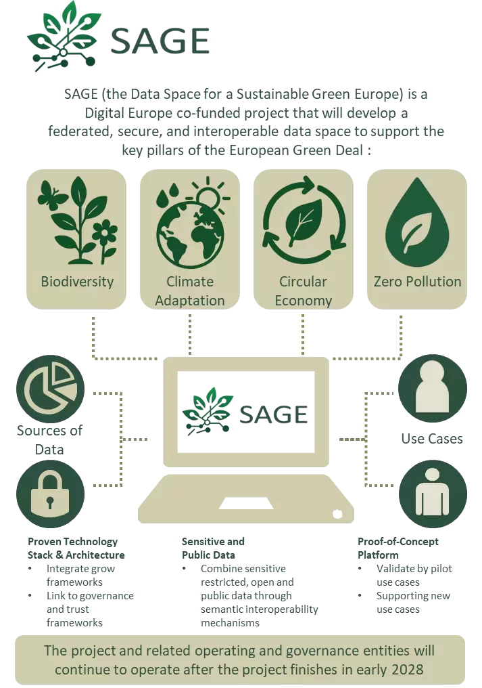
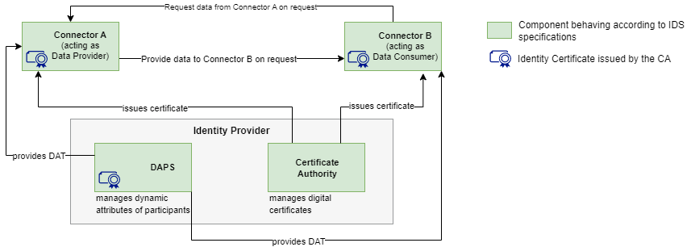

# Inleiding {#12DAD25F}
Vanuit Europa is de afgelopen jaren een uitdagende nieuwe digitaliserings- en data strategie opgesteld. De Europese digitale strategie en data strategie is bedoeld als de grote aanjager van de Europese data-economie. Via regulering en projecten wil de EU meer grip krijgen op haar eigen data via de realisatie van een ‘common EU data space’. Een ‘data space’ is gericht is op het veilig, vertrouwd en soeverein delen van data binnen domeinen en over domeinen heen.  
 
<b>Controle over data</b>  
Datasoevereiniteit zorgt ervoor dat organisaties, overheden en individuen controle hebben over hun data. Met deze controle kunnen ze zelf bepalen hoe hun gegevens worden verzameld, opgeslagen, gedeeld en gebruikt door anderen. Datasoevereiniteit is een spectrum; Het gaat erom de juiste balans te vinden tussen het veilig houden van gegevens en het delen ervan om toegevoegde waarde te krijgen.  
 
<b>Innovatie en vertrouwen</b>  
In een data-economie is vertrouwen essentieel voor het bevorderen van innovatie en het aanmoedigen van deelname aan ecosystemen voor het delen van gegevens. Door gegevenssoevereiniteit vast te stellen en regels voor gegevensbeheer af te dwingen, zoals beleid voor gegevensgebruik en contracten, kunnen organisaties een omgeving van vertrouwen en betrouwbaarheid creëren. Wanneer deelnemers er zeker van zijn dat hun gegevens veilig en zelfbepaald worden behandeld, is de kans groter dat ze deelnemen aan samenwerkingsinitiatieven, wat leidt tot innovatie, kennisdeling en economische groei.  
 
<b>Interoperabiliteit en samenwerking</b>  
Gegevenssoevereiniteit bevordert de interoperabiliteit tussen deelnemers aan dataruimten. Door zich te houden aan gemeenschappelijke technische standaarden kunnen organisaties naadloos gegevens delen en effectief samenwerken op verschillende platforms en domeinen. Het groeiende aantal industriële cloudplatforms en de heterogeniteit van het platformlandschap onderstrepen de noodzaak van normen voor gegevenssoevereiniteit om veilige en betrouwbare gegevensuitwisseling tussen verschillende platforms te garanderen.  
 
Binnen het gedachtegoed van data spaces staat het veilig en vertrouwd uitwisselen van data aldus centraal. Het Dataspace Protocol, dat is ontwikkeld door IDSA is hierin gepositioneerd als een mogelijke voorziene standaard in data spaces om vertrouwd data delen mogelijk te maken. Om voorbereid te zijn op de toekomst is het doel van deze verkenning een beter beeld te krijgen van de wijze waarop het Dataspace Protocol functioneert en kan worden geïmplementeerd in een eenvoudige casus, te weten in een ‘minimum viable dataspace’.  Belangrijke context voor het opzetten van dit experiment zijn de EU common data spaces. In de volgende paragraaf meer daarover.  

## Context experimenten

### EU common data spaces

Het concept data space komt voort uit de Europese Datastrategie. De Europese Data Strategie die begin 2020 is voorgesteld, streeft naar een eenheidsmarkt voor de beschikbaarheid en het gebruik van data. De strategie is daarbij gericht op het wereldwijd concurrentievermogen van Europa en op datasoevereiniteit. Technisch wordt naar een pan-Europese dataspace (dataruimte) gestreefd om te zorgen dat er meer data beschikbaar komt voor socio-economisch gebruik, terwijl bedrijven en individuen die data genereren er wel zeggenschap over blijven houden.  
 
Deze pan-Europese data space wordt opgebouwd met meerdere sectorale data spaces die vervolgens onderling interoperabel zijn (zie figuur 1). Binnen sectoren en thema's zijn er vaak al geldende afspraken t.a.v. standaarden en professionele normen t.a.v. omgang met data, die telkens gebaseerd zijn op de context van die sector. Een data space bouwt daar dan op voort, zowel om dubbel werk te voorkomen als om de vorming van data spaces te versnellen.  

<figure id="Figuur_x">

<figcaption>Europese sectorale data spaces<figcaption>
</figure>

De manier waarop de EC de eenheidsmarkt voor data wil vormen, is middels sectorale data spaces, die vervolgens onderling interoperabel zijn. Binnen sectoren en thema's zijn er vaak meer al geldende afspraken t.a.v. standaarden en professionele normen t.a.v. omgang met data, die telkens gebaseerd zijn op de context van die sector. Een dataspace bouwt daar dan op voort, zowel om dubbel werk te voorkomen als om de vorming van data spaces te versnellen.  
 
Op Europees niveau worden de volgende thema's genoemd als sectorale data spaces, waarop ook acties zijn ingezet: Gezondheid, Mobiliteit, Industrie, Financiële diensten, Energie, Landbouw, Green Deal (waaronder circulaire economie en smart communities), Overheid, Agricultuur, Vaardigheden (onderwijs en arbeidsmarkt), Wetenschap, Cultureel erfgoed, Toerisme, Media en Taal voor meer informatie over de sectorale data spaces zie[[GNVM-HEUI]].  
 
Om de EU common data spaces te realiseren, heeft de Europese commissie het Data Space Support Centre (DSSC) project opgericht. Het DSSC is een Europees initiatief dat ondersteuning biedt bij de ontwikkeling en implementatie van EU data spaces, waarin organisaties op een gecontroleerde, veilige en soevereine manier data kunnen delen. Het DSSC richt zich op het bevorderen van interoperabiliteit, datasoevereiniteit en naleving van EU-regelgeving, zoals de AVG. In het ontwikkelde Bouwstenenmodel voor EU Data Spaces schetst het DSSC de fundamentele componenten die nodig zijn voor de werking van een data space. Dit model biedt een blauwdruk voor veilige en efficiënte data-uitwisseling, en ondersteunt organisaties bij het opzetten van hun eigen data spaces binnen de Europese data-economie. Binnen de technische bouwstenen kunnen we het data connector experiment positioneren binnen de bouwstenen die worden aangeduid met “Data sovereignity and Trust” (zie figuur 2).  

<figure id="Figuur_x">

<figcaption>Technische bouwblokken van een data space ([[DSSC-BP]])<figcaption>
</figure>

De bouwstenen voor datasoevereiniteit en -vertrouwen bieden technische enablers de mogelijkheid om de betrouwbaarheid en authenticiteit van de informatie van deelnemers te garanderen, terwijl deelnemers soevereiniteit kunnen uitoefenen over de data die ze delen. Dit is essentieel voor het opbouwen van vertrouwen tussen deelnemers bij interacties en het uitvoeren van datatransacties. De pijler “Data Sovereignty and Trust" bestaat uit de volgende drie bouwstenen:  
<ol>
  <li>Identiteits- en attestatiebeheer. Het beheer van identiteiten en attesten binnen een data space om de betrouwbaarheid en integriteit van de informatie van de deelnemers te waarborgen;</li>
  <li>Trust Framework. Verificatie dat een deelnemer in een data space zich houdt aan bepaalde regels en een gemeenschappelijke reeks normen;</li>
  <li>Afdwingen van toegangs- en gebruiksbeleid: de mogelijkheid om beleid en regels binnen een bepaalde data space te specificeren door de autoriteit voor de data space en de individuele deelnemers.</li>
</ol>
 
Voor de realisatie van de EU sectorale data spaces heeft de DSSC een blauwdruk of ‘Blueprint’ uitgebracht [[DSSC-BP]]. In de DSSC Blueprint zijn overigens niet alleen de technische bouwstenen, maar ook de besturingsbouwstenen voor de EU sectorale data spaces (‘governance’ bouwstenen’) uitgewerkt. In de blauwdruk is het Dataspace Protocol voor souvereine data delen in EU sectorale data spaces de ‘Foundational Technical Standards’ benoemt en is het IDS Dataspace Protocol een implementatie van de ‘Foundational Technical Standards’  voor de EU sectorale data spaces. Daarbij wordt aangetekend, dat “this protocol only specifies the generic elements. The APIs/technical interfaces for the actual data exchange are data space-specific” [[DSSC-BP]]. Wat dat betekent is onderdeel van deze verkenning.

<aside class='note' title="Handreikingen EU Informatie m.b.t. digitale en datastrategie en Verkenning data spaces">
    Zie ook ‘Handreiking EU Informatie m.b.t. digitale en data-strategie' [[GNVM-HEUI]] voor het wettelijke kader en ‘Verkenning dataspaces’ [[GNVM-VDS]] voor richtinggevende data space initiatieven in Nederland en Europa en de positie van de Nationale Geo-informatie Infrastructuur (NGII) in deze initiatieven.  
</aside>

### SAGE - The data space for a sustainable green Europe

Met dit experiment wordt tevens geanticipeerd op deelname aan het Europese implementatieproject <a href='https://www.greendealdata.eu/' target='_blank'>SAGE</a>, waarin in de periode 2025-2028 gewerkt wordt aan de implementatie en realisatie van 'The data space for a sustainable green Europe'. SAGE is gericht op het verbeteren van de verdere toegankelijkheid, integratie en het gebruik van groene en milieudata in de hele EU. Het moet bedrijven, overheden, onderzoekers en burgers in staat stellen om datagestuurde beslissingen te nemen die aansluiten bij de Europese duurzaamheidsdoelen. Het realiseren van de The data space for a sustainable green Europe', ook wel aangeduid met Green Deal dataspace, wordt gefinancierd onder het Digital Europe Programme met een totaal budget van ongeveer €16 miljoen. Het SAGE consortium heeft meer dan 40 partners, waaronder diverse Nederlandse partijen, zoals SURF, Universiteit Utrecht, CBS, iShare, Sogelink en Geonovum. Een belangrijke rol in SAGE is weggelegd voor 10 use cases, die data spaces creëren voor bossentransformatie, bestuivingsmonitoring, circulaire grondstromen, bouwmilieu CO2 hub & building twins, circulaire textiel, netto-nul-defectproductie, klimaatinvesteringsplannen, milieugevaren voor gezondheid, beoordelingsinstrumentarium natuur en ecosysteemdiensten, luchtkwaliteit en gezondheid. 

<figure id="Figuur_x">

<figcaption>SAGE <figcaption>
</figure>

De use casus “Circulaire grondstromen data space” is door enkele Nederlandse partijen (Sogelink en Geonovum) ingebracht in de realisatie van 'The data space for a sustainable green Europe'. Vandaar dat in dit experiment enkele data deel use cases zijn opgenomen, die onderdeel uitmaken van Circulaire grondstromen. Deze data space is van cruciaal belang voor een betrouwbare uitwisseling van grondstromendata in Nederland en Europa. 

### SAGE - Circulaire grondstromen data space
Grond is een cruciale, waardevolle hulpbron die niet mag worden verspild of verontreinigd. Infrastructuur, dijkversterking, woningbouw, landbouwgrondverbetering en natuurbeheer hebben grond nodig, zoals zand, grind en klei. De hoeveelheden beschikbare primaire grond blijven echter afnemen. Ontgravingswerken waarbij grond vrijkomt, bieden kansen om deze knelpunten aan te pakken. Dergelijke secundaire grond wordt momenteel echter slechts in beperkte mate gerecycled. Naar de toekomst toe is het onvermijdelijk dat grondstromen meer circulair worden. Bovendien moeten de bodemecosystemen in de EU tegen 2050 veerkrachtig en in gezonde toestand zijn. Bescherming, duurzaam gebruik en herstel van de bodem moeten de norm worden. Bodemrecycling en gezonde bodems zijn van cruciaal belang om klimaatneutraliteit te bereiken, veerkrachtig te worden tegen klimaatverandering, een schone en circulaire economie te ontwikkelen, het biodiversiteitsverlies om te buigen, de menselijke gezondheid te beschermen, woestijnvorming een halt toe te roepen en bodemdegradatie om te buigen. 

Om de transitie naar circulaire grondstromen in Nederland en de EU te ondersteunen is uit het    Praktijkvoorbeeld Circulaire Grondstromen van de Basisregistratie Ondergrond (BRO) een twee onderdelen voortgekomen:
<ol>
  <li>Een digitale tweeling (“digital twin”) die op basis van openbare ondergrondgegevens (oa. bodemkwaliteit, milieukwaliteit) in kaart kan brengen hoeveel grond beschikbaar komt, waar die kwaliteit voldoende is, en welke logistieke routes mogelijk zijn;</li>
  <li>Een marktplaats voor grondstromen: een platform waar vraag en aanbod van grond (bijvoorbeeld vrijkomende grond bij bouw- of baggerprojecten) makkelijker verbonden kunnen worden—bij voorkeur dichtbij, zodat transport en milieu-impact beperkt blijven. </li>
</ol>
 

Het SAGE project heeft als doel de verdere ontwikkeling en implementatie en gebruik van de digitale tweeling en marktplaats te stimuleren. Aandacht gaat daarbij nadrukkelijk uit naar:
<ol>
  <li>Gestandaardiseerde data- en rekenmodelkoppelingen: met name gebruik van de BRO om betrouwbare, actuele informatie over ondergrond en milieukwaliteit te gebruiken. De referentie architectuur voor digitale tweelingen en GDDS zijn hierbij leidraad;</li>
  <li>Stimuleren van transacties op de marktplaats en compliance met regels & wetgeving; de marktplaats moet voldoen aan wet- en regelgeving omtrent bodembescherming (omgevingswet), grondverzet, kwaliteitseisen, en logistiek;</li>
  <li>De samenwerking intensiveren met overheden (provincies, ministeries), marktpartijen, softwareleveranciers en kennisinstituten en zowel Nederland als de EU.</li>
</ol>
 

Om ervaring op te doen met vertrouwd data delen bij circulaire grondstromen, voeren we diverse experimenten uit ter ondersteuning van de implementatie in Nederland en Europa. Voor de vertrouwde data uitwisseling maken we gebruik van het Dataspace Protocol en een data space connector (de TNO Security Gateway). Het zijn praktische leer ervaringen, waarvan de gemaakte keuzes en opgedane ervaringen in dit levende document zijn vastgelegd. 

## Doel

Dit experiment is een verkenning naar het gebruiken van het Dataspace Protocol en data connector in een data-deel experiment binnen een eenvoudige praktijkcasus. Het gaat om een praktijk casus waarbij data van een publiek of private partij binnen een minimale functionerende data space vertrouwd en souvereign gedeeld wordt met een vragende partij.  
 
Een belangrijk doel van het experiment is verder kennismaken met het Dataspace Protocol en de data connector en te leren in een eenvoudige praktijkcasus hoe de data connector toe te passen. Daarbij wordt diverse aspecten van de Dataspace Protocol connector in een minimal vailable data space setting toegepast in experimenten uit de praktijk.  
 
Het is een leerexperiment dat is vastgelegd in dit verslag met daarin een onderbouwing van alle gemaakte keuzes en de opgedane bevindingen en aanbevelingen. Bovendien wordt het vastgelegd in online trainingsmateriaal zodat het experiment herhaalbaar is om anderen ook kennis te laten maken met de werking van het Dataspace Protocol.

## Doelgroep

Het “Dataspace Protocol connector experiment” is geschreven voor iedereen die betrokken is bij het uitwisselen van data en het toepassen van standaarden voor data-uitwisseling in de context van data spaces. Dit zijn bijvoorbeeld informatiemanagers, stuurgroepleden, beleidsmedewerkers, projectleiders, adviseurs, architecten, IT-leveranciers, en voor personen die dataproducten, standaarden en specificaties implementeren in hun organisatie en deze data producten willen delen met andere organisaties en dataspace initiatieven in Nederland en Europa.  
 
In het bijzonder richten we ons op iedereen die betrokken is bij het uitwisselen van geo-informatie (of locatie-gebonden informatie), het toepassen van standaarden voor geo-informatie en de Nationale en Europese geo-informatie infrastructuur. Daarvoor worden in het experiment geografische datasets en diensten (API’s) gebruikt.  

## Aanpak experiment

Voor de uitvoering van het experiment is de volgende aanpak gehanteerd. Volgens het concept van een ‘minimum viable data space’ zijn enkele experimenten uitgevoerd met vertrouwd en souvereign data delen. Daarbij is het open en gestandaardiseerd ‘Dataspace Protocol’ toegepast, dat is geïmplementeerd in diverse data connector software producten [[IDS-DCR]]. Er is gebruik gemaakt van de TNO Security Gateway (TSG), die als open source software beschikbaar is.  
 
Een Minimum Viable Data Space (MVDS) is een combinatie van componenten die het mogelijk maken om een data space te creëren met net genoeg functies om bruikbaar te zijn voor veilige en soevereine data-uitwisseling tussen twee partijen, zoals gespecificeerd door de International Data Spaces Association (IDSA). Het doel van een MVDS is om het implementatieproces te stroomlijnen, waardoor het gemakkelijker en sneller wordt om een werkende data space te creëren met veilige en soevereine data-uitwisseling. Door te beginnen met een MVDS kan het ontwikkelteam snel itereren en reageren op de vereisten van de data space, door indien nodig aanpassingen te maken om aan de behoeften van gebruikers te voldoen.  
 
Het MVDS concept willen we toepassen om het werk van het experiment te vergemakkelijken door de implementatietijd te verkorten (door lange details te vermijden die de eerste release zouden vertragen). Dit stelt ons in staat om te beginnen met een eerste werkende versie (waar veilige en soevereine data-uitwisseling tussen twee partijen wordt toegestaan), waar het ontwikkelteam de aannames over de vereisten van de data space kan herhalen, identificeren en erop kan reageren.
 
Voor de uitvoering van het experiment is de volgende aanpak gehanteerd. Volgens het concept van een ‘minimum viable data space’ zijn enkele experimenten uitgevoerd met vertrouwd en souvereign data delen. Daarbij is het open en gestandaardiseerd ‘Dataspace Protocol’ toegepast, dat is geïmplementeerd in diverse data connector software producten. Er is gebruik gemaakt van de TNO Security Gateway (TSG), die als open source software beschikbaar is. Deze <a href='https://internationaldataspaces.org/data-connector-report/' target='_blank'>implementatie van het Dataspace Protocol is gecertificeerd</a> door het IDSA. 
 
Een Minimum Viable Data Space (MVDS) is een combinatie van componenten die het mogelijk maken om een data space te creëren met net genoeg functies om bruikbaar te zijn voor veilige en soevereine data-uitwisseling tussen twee partijen, zoals gespecificeerd door de International Data Spaces Association (IDSA). Het doel van een MVDS is om het implementatieproces te stroomlijnen, waardoor het gemakkelijker en sneller wordt om een werkende data space te creëren met veilige en soevereine data-uitwisseling. Door te beginnen met een MVDS kan het ontwikkelteam snel itereren en reageren op de vereisten van de data space, door indien nodig aanpassingen te maken om aan de behoeften van gebruikers te voldoen.
 
Het MVDS concept willen we toepassen om het werk van het experiment te vergemakkelijken door de implementatietijd te verkorten (door lange details te vermijden die de eerste release zouden vertragen). Dit stelt ons in staat om te beginnen met een eerste werkende versie (waar veilige en souvereine data-uitwisseling tussen twee partijen wordt toegestaan), waar het ontwikkelteam de aannames over de vereisten van de data space kan herhalen, identificeren en erop kan reageren. 
 
</b>Componenten van een MVDS</b>
 
Een MVDS bestaat uit:
<ol>
  <li>Twee connectoren (één als dataprovider en één als dataconsument);</li>
  <li>Een identiteitsprovider (Dynamic Attribute Provisioning Service, Certificate Authority);</li>
  <li>Optionele en aanvullende componenten, zoals een metadata makelaar, een app store, een clearinghouse of een vocabulaireprovider, kunnen aan de MVDS worden toegevoegd om de functionaliteit uit te breiden en meer geavanceerde functies mogelijk te maken, zoals het zoeken naar datasets.</li>
</ol>
 
De MVDS biedt een startpunt voor het experiment om een functionele data space te creëren, die naar behoefte kan worden aangepast en uitgebreid om aan specifieke vereisten te voldoen.

<figure id="Figuur_x">

<figcaption>Minimum Viable Data Space<figcaption>
</figure>

## Leeswijzer

Hoofdstuk twee biedt algemene informatie en achtergronden bij het Dataspace Protocol en de IDS data connector. In hoofdstuk drie zijn de gebruikte begrippen opgenomen. Hoofdstuk vier word de opzet van het experiment toegelicht: de technische werking van het data space protocol en de data connector worden beschreven. In hoofdstuk vijf wordt de uitvoering van het eerste experiment toegelicht; een data deel use case voor het delen van de eigendommenkaart van het Kadaster in een eenvoudige functionele opzet vanuit twee organisaties / platforms. Vervolgens wordt in hoofdstuk zes een tweede experiment uitgevoerd; het uitwisselen van (DCAT) metadata tussen de TSG data connector en andere catalogi. De opgedane bevindingen en evt. aanbevelingen in de experimenten worden beschreven. In hoofdstuk zeven is plaats ingeruimd voor een volgend experiment. Tot slot, wordt in hoofdstuk acht een korte toelichting gegeven op het ontwikkelde online trainingsmateriaal zodat het experiment eenvoudig herhaalbaar is in praktijkworkshops.

