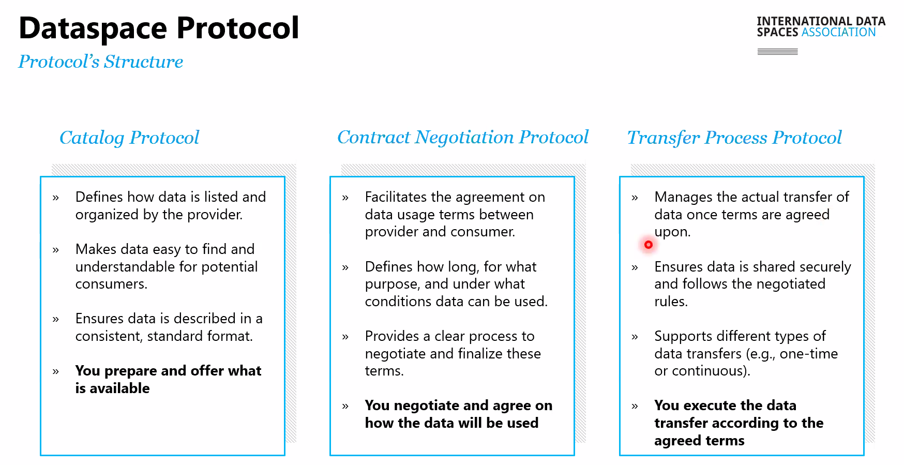
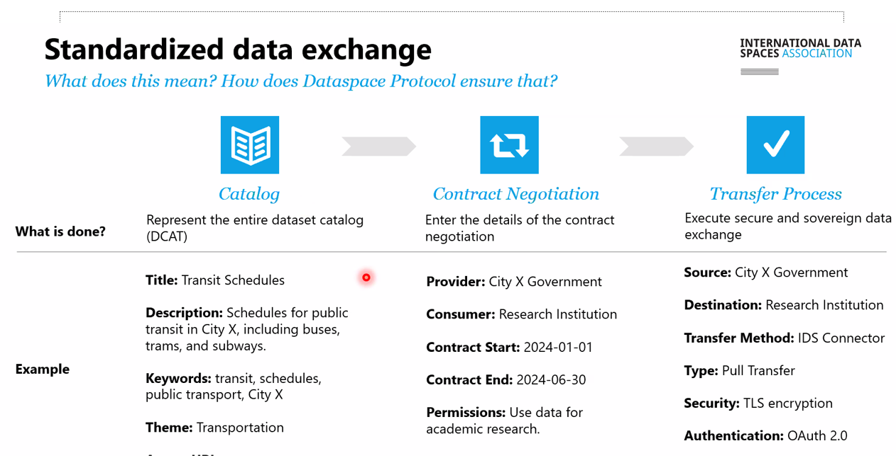

# Het Dataspace Protocol {#4CDCCFF6}
## International Data Spaces {#021221E8}
Het DSP wordt vaak in verband gebracht met bredere data spaces-initiatieven zoals <b>International Data Spaces (IDS)</b> en het <b>GAIA-X project</b>. Deze initiatieven bevorderen de ontwikkeling van veilige, op vertrouwen gebaseerde data-uitwisselingsplatforms binnen Europa en daarbuiten.
 
 
Het Dataspace Protocol is een cruciale stap in de richting van een nieuwe manier van data-uitwisseling, waarbij controle, veiligheid en interoperabiliteit centraal staan. Het biedt een gestandaardiseerde manier voor organisaties om data te delen zonder dat ze hun soevereiniteit over die data verliezen. Vooral in sectoren waar vertrouwelijkheid en veiligheid van groot belang zijn, zoals gezondheidszorg, productie en logistiek, biedt dit protocol grote voordelen.
 
 
De implementatie van het Dataspace Protocol heeft in de afgelopen jaren een behoorlijke vlucht genomen. 
## Dataspace protocol {#61F4DA82}
### Eigenschappen van het Dataspace Protocol {#77B01D4C}
Het Dataspace Protocol is een technische standaard en raamwerk dat bedoeld is om veilige en soepele data-uitwisseling mogelijk te maken tussen verschillende partijen en systemen. Dit protocol speelt een cruciale rol in het opzetten van een <b>data </b><b>space</b> — een gedeelde digitale ruimte waarin organisaties data kunnen delen op een gecontroleerde, veilige en privacy vriendelijke manier. 
 
 
Het Dataspace Protocol is ontworpen om een aantal belangrijke uitdagingen rond data-uitwisseling op te lossen:
<ul><li><b>Interoperabiliteit</b>: Het stelt verschillende systemen in staat om op een uniforme manier gegevens uit te wisselen, onafhankelijk van de technologie of het platform dat ze gebruiken.</li>
<li><b>Data-soevereiniteit</b>: Elke data-eigenaar houdt controle over wie toegang heeft tot hun data en onder welke voorwaarden.</li>
<li><b>Privacy en veiligheid</b>: Het protocol waarborgt dat data op een veilige manier wordt gedeeld, waarbij privacyrichtlijnen worden nageleefd, zoals de AVG (GDPR).</li>
<li><b>Transparantie</b>: Deelnemers aan een data space kunnen altijd zien wie hun data gebruikt en waarvoor deze wordt gebruikt.</li>
</ul>
 
 
<b>Belangrijkste componenten van het </b><b>Dataspace</b><b> Protocol</b>
Het Dataspace Protocol bestaat uit verschillende componenten en mechanismen, die samenwerken om betrouwbare data-uitwisseling mogelijk te maken:
<ul><li><b>Data Providers en Data </b><b>Consumers</b>: Dit zijn respectievelijk de partijen die data delen en die toegang willen tot die data. Het protocol maakt afspraken over de rollen van beide partijen.</li>
<li><b>Connectoren</b>: Dit zijn technische componenten die data-uitwisseling mogelijk maken. De connectoren zorgen ervoor dat de data veilig en in overeenstemming met de voorwaarden van de data-eigenaar wordt gedeeld. De <b>IDS Connector</b> van het International Data Spaces initiatief is een voorbeeld van zo'n connector.</li>
<li><b>Toestemmings- en voorwaardenbeheer</b>: Data-eigenaren kunnen via het protocol gedetailleerde voorwaarden instellen voor het delen van hun data. Denk hierbij aan beperkingen op het gebruik, tijdsduur, of zelfs geografische restricties.</li>
<li><b>Certificering en trust </b><b>frameworks</b>: Het DSP zorgt voor vertrouwen tussen partijen door middel van certificeringsmechanismen. Alleen gecertificeerde deelnemers kunnen toegang krijgen tot de data space, wat een zekere mate van zekerheid en veiligheid biedt.</li>
</ul>
 
 
Het protocol bestaat uit 3 verschillende protocollen:
<ol><li>Catalog protocol</li>
<li>Contract negotiation protocol</li>
<li>Transfer process protocol</li>
</ol>
 
 
</img>
 
 
</img>
 
 
<b>Voordelen van het </b><b>Dataspace</b><b> Protocol</b>
<ul><li>Controle en soevereiniteit: Organisaties behouden de controle over hun eigen data, zelfs als ze deze delen met andere partijen;</li>
<li>Verhoogde samenwerking: Door een standaard zoals DSP kunnen organisaties makkelijker samenwerken en data delen, wat leidt tot nieuwe kansen en innovatie;</li>
<li>Veiligheid en naleving: Dankzij ingebouwde privacybescherming en security-mechanismen wordt voldaan aan de strengste normen, waaronder de Europese privacyregelgeving (AVG).</li>
</ul>
### Catalog protocol {#2E1AE007}
pm
### Contract negotiation potocol {#7774D9F4}
pm
### Transfer protocol {#7C75A7C4}
pm
## Control plane and data plane {#3F4448FC}
## Dataspace Protocol connectors {#15F866F1}
Pm
