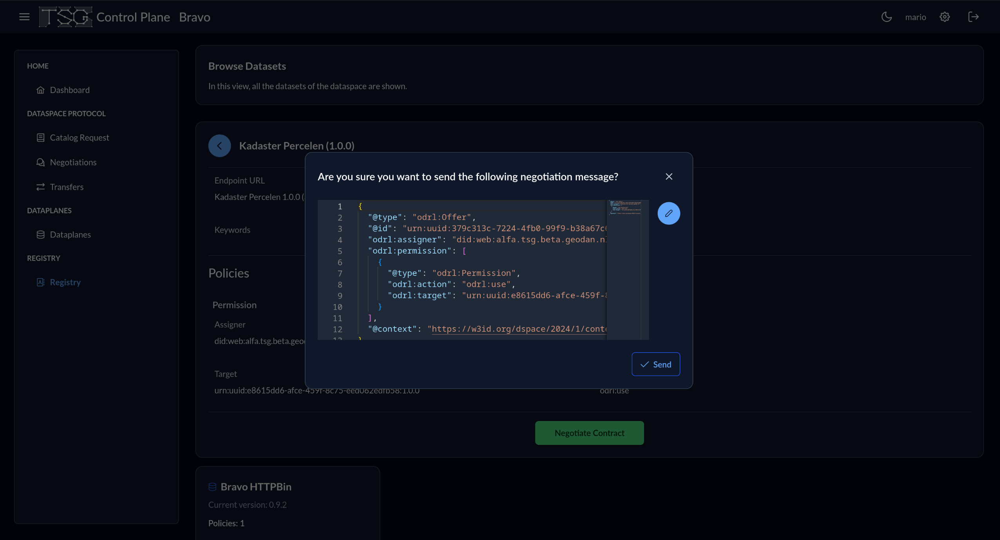

# Opzet experiment {#01340370}

## Systeem opzet van de minimum viable dataspace {#001BD7C0}

Our experimental objective is to verify whether we can achieve a data transfer between two connectors beloging to a dataspace ecosystem. In this regard, each dataspace connector may act as a data provider, consumer or both. Moreover, connectors are linked to dataspace participant who can be people, institutions, companies or possibly governaments. In our specific setting, we deploy a single data provider, named `Alfa`, and consumer, named `Bravo`, under the same participant for the sake of the
simulation, and we accomplish an HTTP request using the OGC API.

## TNO Security Gateway (TSG) {#6193360E}

The TNO Security Gateway is ready-to-use implementation of dataspace componenents offered by TNO. The documentation provided along with the project explains us how to deploy a full working dataspace ecosystem on a cloud environment of ours. Let us focus on the module subdivision provided by TNO regarding each dataspace connector.

- **Control Plane**
- **HTTP Data Plane**
- **Wallet**

Each module has fundamental functions and cannot be discarded in the context of a barebone and functional dataspace connector. Moreover, after a basic TNO deployment, each module has its own dashboard service running. We will be using these dashboards to demonstrate the basic dataspace workflow and experiment.

### TSG Control Plane  {#4125B625}

The control plane works as the brain of a dataspace connector and allows us to do the vast majority of the things promised by the dataspace protocol. In the first place, it allows authentication by generating a token valid for a fixed amount of time and usable for subsequent operations. When we authenticate, we might look at the catalogs, initiate a negotation with another connector as data provider using this connector as data consumer, and possibly follow up with a data transfer.

### TSG HTTP Data Plane  {#5EC97A70}

The data plane acts as the counter part of the control plane for a specific connector. In simple words, it follows the indications of the control plane in regard to data transfer. For instance, when used as a consumer's data plane, it allows as to make direct data downloads or to fetch data through API requests from a provider's data plane.

### TSG Wallet  {#726B0216}

The wallet holds the verifiable credentials for each participant in the dataspace. Again, a participant can be associated to multiple connectors while the opposite is not true. A central wallet (or multiple ones) issues credentials to participants within the dataspace ecosystem.

## Functies en processen van de minimum viable data space {#01C8311E}

We describe in this section how to undertake the core steps towards a data transfer between two connectors acting separately as data consumer and provider.

### Onboarding door producent en consument {#4D30B938}

The onboarding of the data provider `Alfa`, in this case, implies the deployment of the datasets and APIs it features. On the other hand, for a data consumer like `Bravo`, no data deployment is required.

### Dataproducten aanbieden {#32BDC7C7}

Through the registry visible within the `Bravo`'s control plane, we can see the different connectors being part of the ecosystem and their related control planes' addresses. In this case, we have `Alfa` and `Bravo`.

</img>

### Bekijken en wijzigen van condities (‘policies’) {#143AA289}

We show how to change rules for `Bravo`'s dataset `BravoHTTPBin`. YOu can freely add permissions and prohibitions.

</img>

### Zoeken van catalogi van andere aanbieders (participanten) {#59F4CA7D}

In the following paragraphs, we show how to explore the data catalogs of each connector.

### Zoek dataproducten in de catalog {#79E15E32}

In the `Registry` within a connector's control plane, we can find the list of data resources offered by the current connector and the external connectors of which ours is aware.

</img>

In the example picture, we can see the dataset `Bravo HTTPBin` belonging to our consumer's connector `Bravo` as well as `Kadaster Percelen` and `Alfa HTTPBin` belonging to `Alfa`.

### Contractonderhandeling producent en consument  {#288808F5}

The negotation of a contract concerning a specific data product involves multiple steps between the consumer and provider. First, as the consumer `Bravo`, we forward a negotation request to `Alfa`, the provider, as follows.

</img>

Now, the provider `Alfa` will decide whether to proceed or not with the negotation received from `Bravo`.

</img>

In case of acceptance, and after signing and countersigning on both connectors' control planes, `Bravo` is finally allowed to ask the data transfer as shown in the following picture.

</img>

### Data transfer tussen producent en consument  {#7BC4931F}

Once the consumer requests the transfer to the provider, the transfer can be considered initiated and stays "open" until marked as `Terminated` or `Complete` by any of the parties involved.

</img>

What does "open" mean? It means that actual data transfers can be performed between the data planes of the consumer and provider. To really move data from the provider `Alfa` to the consumer `Bravo`, we need to authenticate into the consumer's data plane interface and forward a specific HTTP request to the provider's exposed API. In this case, we use the OGC API endpoint exposed through `Alfa`'s Kadaster data plane to request a collections of Dutch buildings.

</img>

Here follows the response got from such a request.

</img>
