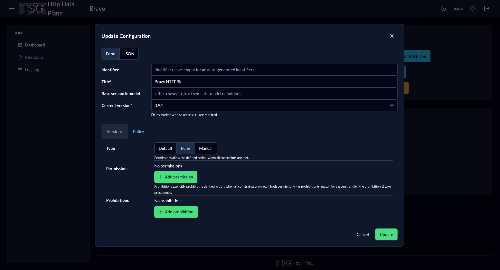
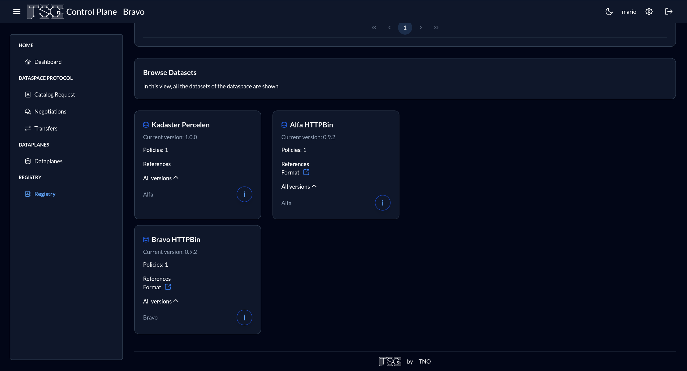

# Opzet experiment {#01340370}
## Aanpak experiment; minimum viable data space {#38020F80}
Voor de uitvoering van het experiment is de volgende aanpak gehanteerd. Volgens het concept van een ‘minimum viable data space’ is met twee of drie use cases binnen de casus Circulaire grondstromen een experiment uitgevoerd met vertrouwd en souvereign data delen. Daarbij is het open en gestandaardiseerd ‘Dataspace Protocol’ toegepast, dat is geïmplementeerd in diverse data connector software producten. Er is gebruik gemaakt van de TNO Security Gateway (TSG), die als open source software beschikbaar is. Deze <a href='https://internationaldataspaces.org/data-connector-report/' target='_blank'>implementatie van het Dataspace Protocol is gecertificeerd</a> door het IDSA. 
 
 
Een Minimum Viable Data Space (MVDS) is een combinatie van componenten die het mogelijk maken om een data space te creëren met net genoeg functies om bruikbaar te zijn voor veilige en soevereine data-uitwisseling tussen twee partijen, zoals gespecificeerd door de International Data Spaces Association (IDSA). Het doel van een MVDS is om het implementatieproces te stroomlijnen, waardoor het gemakkelijker en sneller wordt om een werkende data space te creëren met veilige en soevereine data-uitwisseling. Door te beginnen met een MVDS kan het ontwikkelteam snel itereren en reageren op de vereisten van de data space, door indien nodig aanpassingen te maken om aan de behoeften van gebruikers te voldoen.
 
 
Het MVDS concept willen we toepassen om het werk van het experiment te vergemakkelijken door de implementatietijd te verkorten (door lange details te vermijden die de eerste release zouden vertragen). Dit stelt ons in staat om te beginnen met een eerste werkende versie (waar veilige en soevereine data-uitwisseling tussen twee partijen wordt toegestaan), waar het ontwikkelteam de aannames over de vereisten van de data space kan herhalen, identificeren en erop kan reageren. 

</b>Componenten van een MVDS</b>
Een MVDS bestaat uit:
1. Twee connectoren (één als dataprovider en één als dataconsument); 
2. Een identiteitsprovider (Dynamic Attribute Provisioning Service, Certificate Authority)
3. Optionele en aanvullende componenten, zoals een metadata makelaar, een app store, een clearinghouse of een vocabulaireprovider, kunnen aan de MVDS worden toegevoegd om de functionaliteit uit te breiden en meer geavanceerde functies mogelijk te maken, zoals het zoeken naar datasets.
 
 
De MVDS biedt een startpunt voor het experiment om een functionele data space te creëren, die naar behoefte kan worden aangepast en uitgebreid om aan specifieke vereisten te voldoen.
</img>
 
 
Voor de uitvoering van dit experiment wordt de volgende aanpak voorgesteld. De volgende activiteiten worden uitgevoerd om het Dataspace Protocol experiment uit te voeren: 
<ol><li>Opstellen en ontwerpen use case data delen MVDS concept. Use case i.s.m. Kadaster en CBS. In overleg met Geonovum organiseert opdrachtnemer daarvoor enkele interactieve workshops, zowel vanuit het perspectief van de evt. opgave en data (value case; welke data te delen en waarvoor), welke standaarden worden gebruikt en generieke voorzieningen worden geraadpleegd of uitgevraagd, als ook vanuit rollen en verantwoordelijkheden van de betrokken partijen in het experiment; </li>
<li>Ontwerpen en inrichten van een experimenteeromgeving en evt. bij de deelnemende partijen, zodat alle benodigde technische bouwstenen beschikbaar zijn voor het data-deel experiment;</li>
<li>Uitvoeren data deel experiment tussen de deelnemende partijen. Dat betekent dat de IDSA Dataspace Protocol connectoren worden gevoed met relevante (meta)data, zodat de vertrouwde data-uitwisseling kan worden getest en twee of drie use cases; </li>
<li>De resultaten (bevindingen en aanbevelingen) worden geanalyseerd in enkele workshops en de uitgevoerde data-deel experiment wordt beschreven, de bevindingen en aanbevelingen worden in opstellen;</li>
<li>Opstellen en afstemmen van de rapportage in een respec document; </li>
<li>Presentatie en communicatie van de resultaten in de relevante gremia. <ul><li>Indien nodig zal opdrachtgever een technische experimenteeromgeving (als producer of consumer in een MVDS) beschikbaar stellen voor de opdrachtnemer;</li>
<li>Publicatie van en/of over de eindresultaten van deze opdracht om de kennis en toepassing ervan te bevorderen door communicatie via de Geonovum website en nieuwsbrieven. </li>
</ul>
</li>
</ol>

## Systeemopzet van de minimum viable dataspace {#001BD7C0}
Ons experiment is bedoeld om te verifiëren of we een gegevensoverdracht kunnen realiseren tussen twee connectors binnen een dataspace-ecosysteem. Binnen dit ecosysteem kan elke dataspace-connector fungeren als gegevensaanbieder, consument of beiden. Bovendien zijn connectors gekoppeld aan dataspace-deelnemers (participants), die mensen, instellingen, bedrijven of mogelijk overheden kunnen zijn. In onze specifieke opzet implementeren we één gegevensaanbieder, genaamd `Alfa`, en één consument, genaamd `Bravo`, onder dezelfde deelnemer voor simulatie-doeleinden. We voeren een HTTP-verzoek uit met behulp van de OGC API.

## TNO Security Gateway (TSG) {#6193360E}
De TNO Security Gateway is een kant-en-klare implementatie van dataspace-componenten die door TNO worden aangeboden. De documentatie die bij het project wordt geleverd, legt uit hoe een volledig werkend dataspace-ecosysteem op een eigen cloudomgeving kan worden geïmplementeerd. Heronder richten we ons op de modulaire indeling van de dataspace-connector zoals beschreven door TNO:

- **Control Plane**
- **HTTP Data Plane**
- **Wallet**

Elke module heeft fundamentele functies en kan niet worden weggelaten in de context van een minimale en functionele dataspace-connector. Bovendien heeft elke module na een basisimplementatie van TNO zijn eigen dashboard-service. We zullen deze dashboards gebruiken om de basisworkflow en het experiment binnen een dataspace te demonstreren.

### TSG Control Plane {#4125B625} 
De control plane fungeert als het "brein" van een dataspace-connector en stelt ons in staat het grootste deel van de functionaliteiten van het dataspace-protocol uit te voeren. Het biedt onder andere authenticatie door een token te genereren dat een vastgestelde tijd geldig is en dat kan worden gebruikt voor verdere acties. Na authenticatie kunnen we catalogi bekijken, een onderhandeling starten met een andere connector (bijvoorbeeld als gegevensaanbieder) en eventueel overgaan tot een gegevensoverdracht.

### TSG HTTP Data Plane {#5EC97A70}
De data plane fungeert als tegenhanger van de control plane voor een specifieke connector. Simpel gezegd volgt het de instructies van de control plane met betrekking tot gegevensoverdracht. Als het wordt gebruikt als consument, stelt het ons in staat directe gegevensdownloads uit te voeren of gegevens op te halen via API-requests van de data plane van een aanbieder.

### TSG Wallet {#726B0216}
De wallet bevat de verifieerbare referenties voor elke deelnemer binnen de dataspace. Een deelnemer kan aan meerdere connectors worden gekoppeld, maar andersom is dit niet het geval. Een centrale wallet (of meerdere wallets) geeft referenties uit aan deelnemers binnen het dataspace-ecosysteem.

## Functies en processen van de minimum viable dataspace {#01C8311E}
In deze sectie beschrijven we de kernstappen die nodig zijn voor een gegevensoverdracht tussen twee connectors die afzonderlijk optreden als consument en aanbieder.

### Onboarding door aanbieder en consument {#4D30B938}

### Dataproducten aanbieden {#32BDC7C7}

### Bekijken en wijzigen van condities (‘policies’) {#143AA289}
We laten zien hoe regels kunnen worden gewijzigd voor de dataset `BravoHTTPBin` van `Bravo`. Je kunt vrijelijk toestemmingen en verboden toevoegen.

</img>

### Zoeken van catalogi van andere aanbieders ('participants') {#59F4CA7D}

### Zoek dataproducten in de catalogus {#79E15E32}
In de `Registry` binnen de control plane van een connector kunnen we de lijst vinden van gegevensbronnen die worden aangeboden door de huidige connector en de externe connectors waarvan onze connector op de hoogte is.

</img>

In het voorbeeld zien we de dataset `Bravo HTTPBin` dat toebehoort aan de consument `Bravo` evenals `Kadaster Percelen` en `Alfa HTTPBin` die toebehoren aan `Alfa`.

### Contractonderhandeling aanbieder en consument {#288808F5}
De onderhandeling over een contract met betrekking tot een specifiek dataproduct omvat meerdere stappen tussen de consument en aanbieder. Eerst stuurt de consument `Bravo` een onderhandelingsverzoek naar de aanbieder `Alfa` zoals hieronder weergegeven.

</img>

Nu beslist de aanbieder `Alfa` of hij de ontvangen onderhandeling van `Bravo` wil accepteren.

</img>

Bij acceptatie, en na ondertekening en tegenondertekening op beide control planes, mag `Bravo` uiteindelijk de gegevensoverdracht aanvragen zoals in de volgende afbeelding wordt getoond.

</img>

### Gegevensoverdracht tussen aanbieder en consument {#7BC4931F}
Zodra de consument de overdracht aanvraagt bij de aanbieder, wordt de overdracht als gestart beschouwd en blijft "open" totdat deze door een van de betrokken partijen als `Beëindigd` of `Voltooid` wordt gemarkeerd.

</img>

Wat betekent "open"? Het betekent dat daadwerkelijke gegevensoverdrachten kunnen worden uitgevoerd tussen de data planes van de consument en aanbieder. Om echt gegevens van aanbieder `Alfa` naar consument `Bravo` te verplaatsen, moeten we authenticeren op de interface van de data plane van de consument en een specifiek HTTP-verzoek doorsturen naar de API van de aanbieder. In dit geval gebruiken we de OGC API-endpoint die beschikbaar is via de Kadaster data plane van `Alfa` om een verzameling Nederlandse gebouwen op te vragen.

</img>

De response van het verzoek ziet er dan als volgt uit:

</img>
