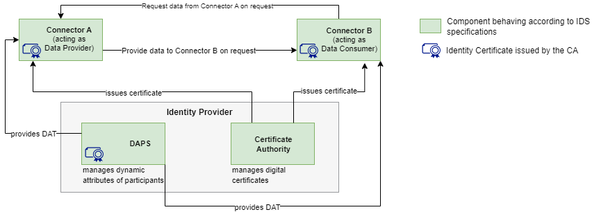

# Opzet experiment {#01340370}
## Aanpak experiment; minimum viable data space {#38020F80}
Voor de uitvoering van het experiment is de volgende aanpak gehanteerd. Volgens het concept van een ‘minimum viable data space’ is met twee of drie use cases binnen de casus Circulaire grondstromen een experiment uitgevoerd met vertrouwd en souvereign data delen. Daarbij is het open en gestandaardiseerd ‘Dataspace Protocol’ toegepast, dat is geïmplementeerd in diverse data connector software producten. Er is gebruik gemaakt van de TNO Security Gateway (TSG), die als open source software beschikbaar is. Deze <a href='https://internationaldataspaces.org/data-connector-report/' target='_blank'>implementatie van het Dataspace Protocol is gecertificeerd</a> door het IDSA. 
 
 
Een Minimum Viable Data Space (MVDS) is een combinatie van componenten die het mogelijk maken om een data space te creëren met net genoeg functies om bruikbaar te zijn voor veilige en soevereine data-uitwisseling tussen twee partijen, zoals gespecificeerd door de International Data Spaces Association (IDSA). Het doel van een MVDS is om het implementatieproces te stroomlijnen, waardoor het gemakkelijker en sneller wordt om een werkende data space te creëren met veilige en soevereine data-uitwisseling. Door te beginnen met een MVDS kan het ontwikkelteam snel itereren en reageren op de vereisten van de data space, door indien nodig aanpassingen te maken om aan de behoeften van gebruikers te voldoen.
 
 
Het MVDS concept willen we toepassen om het werk van het experiment te vergemakkelijken door de implementatietijd te verkorten (door lange details te vermijden die de eerste release zouden vertragen). Dit stelt ons in staat om te beginnen met een eerste werkende versie (waar veilige en soevereine data-uitwisseling tussen twee partijen wordt toegestaan), waar het ontwikkelteam de aannames over de vereisten van de data space kan herhalen, identificeren en erop kan reageren. 

</b>Componenten van een MVDS</b>
Een MVDS bestaat uit:
1. Twee connectoren (één als dataprovider en één als dataconsument); 
2. Een identiteitsprovider (Dynamic Attribute Provisioning Service, Certificate Authority)
3. Optionele en aanvullende componenten, zoals een metadata makelaar, een app store, een clearinghouse of een vocabulaireprovider, kunnen aan de MVDS worden toegevoegd om de functionaliteit uit te breiden en meer geavanceerde functies mogelijk te maken, zoals het zoeken naar datasets.
 
 
De MVDS biedt een startpunt voor het experiment om een functionele data space te creëren, die naar behoefte kan worden aangepast en uitgebreid om aan specifieke vereisten te voldoen.
</img>
 
 
Voor de uitvoering van dit experiment wordt de volgende aanpak voorgesteld. De volgende activiteiten worden uitgevoerd om het Dataspace Protocol experiment uit te voeren: 
<ol><li>Opstellen en ontwerpen use case data delen MVDS concept. Use case i.s.m. Kadaster en CBS. In overleg met Geonovum organiseert opdrachtnemer daarvoor enkele interactieve workshops, zowel vanuit het perspectief van de evt. opgave en data (value case; welke data te delen en waarvoor), welke standaarden worden gebruikt en generieke voorzieningen worden geraadpleegd of uitgevraagd, als ook vanuit rollen en verantwoordelijkheden van de betrokken partijen in het experiment; </li>
<li>Ontwerpen en inrichten van een experimenteeromgeving en evt. bij de deelnemende partijen, zodat alle benodigde technische bouwstenen beschikbaar zijn voor het data-deel experiment;</li>
<li>Uitvoeren data deel experiment tussen de deelnemende partijen. Dat betekent dat de IDSA Dataspace Protocol connectoren worden gevoed met relevante (meta)data, zodat de vertrouwde data-uitwisseling kan worden getest en twee of drie use cases; </li>
<li>De resultaten (bevindingen en aanbevelingen) worden geanalyseerd in enkele workshops en de uitgevoerde data-deel experiment wordt beschreven, de bevindingen en aanbevelingen worden in opstellen;</li>
<li>Opstellen en afstemmen van de rapportage in een respec document; </li>
<li>Presentatie en communicatie van de resultaten in de relevante gremia. <ul><li>Indien nodig zal opdrachtgever een technische experimenteeromgeving (als producer of consumer in een MVDS) beschikbaar stellen voor de opdrachtnemer;</li>
<li>Publicatie van en/of over de eindresultaten van deze opdracht om de kennis en toepassing ervan te bevorderen door communicatie via de Geonovum website en nieuwsbrieven. </li>
</ul>
</li>
</ol>

## Systeem opzet van de minimum viable dataspace {#001BD7C0}
Pm [zie RAM4 IDSA]
## TNO Security Gateway (TSG) {#6193360E}
Pm
### TSG Control Plane  {#4125B625}
Pm
### TSG HTTP Data Plane  {#5EC97A70}
### TSG Wallet  {#726B0216}
## Functies en processen van de minimum viable data space {#01C8311E}
### Onboarding door producent en consument {#4D30B938}
pm
### Dataproducten aanbieden {#32BDC7C7}
pm
### Bekijken en wijzigen van condities (‘policies’) {#143AA289}
pm
### Zoeken van catalogi van andere aanbieders (participanten) {#59F4CA7D}
pm
### Zoek dataproducten in de catalog {#79E15E32}
pm
### Contractonderhandeling producent en consument  {#288808F5}
pm
### Data transfer tussen producent en consument  {#7BC4931F}
pm
