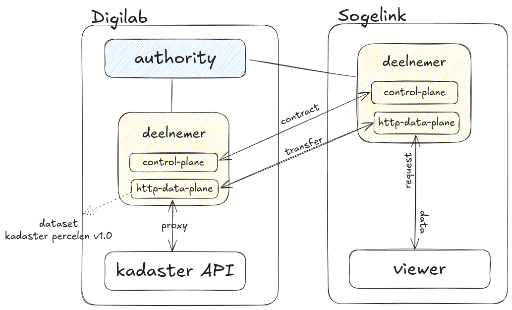

# Uitvoering experiment en use cases Circulaire grondstromen {#181E2B20}
## Use cases Digital Twin Circulaire grondstromen {#2152E6F8}
De Circulaire Grondstromen Use Case onderzoekt of een dataspace kan worden
ingezet om een marktplaats voor grond te faciliteren. Door de groeiende vraag
naar kwalitatief goede grond voor bouwprojecten wordt het steeds moeilijker
om aan deze vraag te voldoen. Tegelijkertijd nemen de beschikbare hoeveelheden
grond af, vooral bij hoogwaardige zandsoorten. Dit creëert een dringende behoefte
aan een duurzame manier van grondgebruik en grondverplaatsing.

Graafwerkzaamheden waarbij grond wordt gewonnen, bieden kansen om de opkomende
knelpunten aan te pakken. In de toekomst is het onvermijdelijk dat grondketens
veel circulairder worden. Om tekorten te voorkomen, is het cruciaal om gewonnen
grond efficiënt te koppelen aan de bestaande vraag. Dit matchen van secundaire
grond aan de vraag is echter complex en afhankelijk van de eigenschappen van
grondpartijen (soort, kwaliteit, volume), tijdsbeperkingen en transportlogistiek.
Omdat deze gegevens en informatie versnipperd zijn, ontbreekt vaak het overzicht.

Een geïntegreerde, datagedreven aanpak kan helpen om vraag en aanbod slimmer op
elkaar af te stemmen. Een dataspace kan hierin een belangrijke rol spelen. Door
aanbieders en afnemers van grond via een dataspace te laten samenwerken, kan slimme
software de vraag en het aanbod matchen en zo efficiëntere grondverplaatsing mogelijk maken.

Onderstaande afbeelding geeft functioneel weer hoe grondafnemers en grondaanbieders aan elkaar gekoppeld kunnen worden.
</img>
De linkerkant van de het schema toont de grondafnemer en de rechterkant de aanbieder.
De belangrijkste elementen worden hieronder beschreven:

### Hoofdprocessen
1. **Gronddata ophalen**
   - Door middel van open overheidsdata wordt informatie over de grond verzameld.

2. **Digitale ondergrond raadplegen**
   - Op basis van verzamelde gegevens wordt de digitale ondergrond geraadpleegd
     om een overzicht te krijgen van de hoeveelheden en kenmerken van beschikbare grond.

3. **Gronddata uploaden**
   - Informatie over beschikbare grond wordt geüpload zodat het beschikbaar wordt voor verdere analyse.

4. **Controleren of bodemkwaliteit voldoet aan wetgeving**
   - De kwaliteit van de grond wordt gecontroleerd om te voldoen aan relevante wet-
     en regelgeving.

5. **Bepaal grondpotentie**
   - De potentie van de grond wordt bepaald door middel van een rekenmodel, bijvoorbeeld voor hergebruik of andere
     toepassingen.

6. **Vinden van een match**
   - Het proces richt zich op het vinden van een optimale match tussen vraag en aanbod
     door:
     - **Kortste route vinden**: De optimale route vinden via water en/of weg.
     - **Opsommen vraag en aanbod**: Het overzichtelijk maken van beschikbare grond
       en benodigde grond.

7. **Opslaan specificaties**
   - Zowel de specificaties van grondaanbod als -vraag worden opgeslagen om later te
     gebruiken bij het matchen.

### Betrokken actoren
- **Aannemer of grondroerder (aanbod)**
  - Aannemer of grondroerder met een overschot aan grond.

- **Aannemer of grondroerder (vraag)**
  - Aannemer of grondroerder met een tekort aan grond.

- **Matchmaker**
  - De matchmaker (overheid) faciliteert het vinden van een match.

### Geïntegreerde datadiensten
- De functionele omschrijving van een dataspace. De relevante functies voor deze usecase van de dataspace zijn onderverdeeld in vier categorieën:
  - **Identificeren**: Het faciliteren van het toegang verlenen op basis identificatie.
  - **Data ophalen**: Gebruikers of applicaties hebben de mogelijkheid om data uit verschillende bronnen op te halen.
  - **Dataset vinden**: Gebruikers of applicaties kunnen zoeken naar specifieke datasets.
  - **Data publiceren**: Het beschikbaar maken van data voor alle betrokkenen.

In onderstaande afbeelding zijn bijbehorende applicatie- en databouwblokken toegevoegd en geeft een overzicht van de archtiectuur van de Circulaire grondstromen Use Case volgens de Archimate standaard.
</img>

Een afbeelding met alleen de applicatie en databouwblokken ziet er dan als volgt uit:
</img>

In bovenstaande afbeelding is duidelijk te zien dat de data space een centrale rol speelt in het applicatielandschap.
De data space fungeert als een soort 'hub' waar alle data samenkomt en vanuit waar de data wordt gedeeld met de verschillende applicaties.
De data zelf is niet opgeslagen in de data space, maar wordt vanuit de data space opgehaald en gedeeld met de applicaties die deze data nodig hebben vanuit de zogenaamde dataplanes.


## Experiment 1: Opzetten van een mimimum viable dataspace:  {#1200E5F8}

### Use Case

Dit experiment richt zich op het opzetten van een minimale dataspace met behulp van de TNO Security Gateway (TSG) binnen een Kubernetes-cluster. Het doel is om een schaalbare en veilige dataspace te creëren waarin meerdere partijen data kunnen delen en beheren op basis van overeengekomen afspraken en protocollen. Het ecosysteem simuleert een situatie waarin een centrale autoriteit toezicht houdt op twee deelnemers, die elk toegang krijgen tot gedeelde data volgens specifieke policies.

### Doelstelling

- Het valideren van de functionaliteit van TSG in een Kubernetes-gebaseerde omgeving.
- Het simuleren van een dataspace waarin een autoriteit en deelnemers samenwerken.
- Het uitvoeren van een data-uitwisselingsexperiment.

### Relevantie

Dit experiment toont de mogelijkheden van TSG voor het opzetten van een dataspace-ecosysteem in een gecontaineriseerde omgeving. Het laat zien hoe dataspace-partijen data kunnen delen binnen een gecontroleerde en veilige omgeving. Dit is een essentiële stap in het realiseren van interoperabele en veilige dataspaces voor toekomstige toepassingen.

### Opstelling

**Infrastructuur:**
Het dataspace-ecosysteem is opgezet binnen een Kubernetes-cluster op de omgeving van Sogelink. Dit cluster host zowel de autoriteit als de twee deelnemers.

**TNO Security Gateway (TSG):**
Alle dataspace-entiteiten maken gebruik van de TSG-componenten om data-uitwisseling te faciliteren en beveiligingsmechanismen te handhaven.

- Autoriteit: Beheert de registratie van deelnemers, policies en data catalogus.
- Deelnemer 1 (alfa): Fungeert als data-aanbieder.
- Deelnemer 2 (bravo): Fungeert als data-afnemer.

**Technologieën:**
- Kubernetes voor het beheer van containers en schaalbaarheid.
- TSG voor dataspace-beveiliging en gegevensbeheer.
- TSG CLI voor het creëren van een configuratie en de uitrol van het eco-systeem.

### Opzetten van het dataspace-ecosysteem

#### Benodigdheden

##### NodeJS & NPM

Voor het installeren van de TSG CLI is NodeJS en NPM vereist. Wanneer deze nog niet geïnstalleerd zijn zoek dan de juiste installatie-instructies voor jouw besturingssysteem.

##### TSG CLI

TNO heeft een CLI-tool ontwikkeld die het uitrollen van een TSG-ecosysteem vergemakkelijkt. Deze tool kan geïnstalleerd worden met het volgende commando:

```bash
npm install -g @tsg-dsp/cli@latest
```

Meer informatie over de TSG CLI is te vinden in de [documentatie](https://tsg.dataspac.es/docs/tools/cli/)

##### Kubectl

Om verbinding te maken met het Kubernetes-cluster is kubectl vereist. Zorg ervoor dat kubectl correct is geconfigureerd en toegang heeft tot het cluster waar het eco-systeem wordt uitgerold.

#### Stappen

##### Voorbereiding: TSG Bootstrapping

Met de TSG CLI kunnen de configuratiebestanden voor het dataspace-ecosysteem worden gegenereerd. Een voorbeeldconfiguratie is te vinden in de [TSG-repository](https://gitlab.com/tno-tsg/dataspace-protocol/tno-security-gateway/-/blob/main/website/docs/deployment/ecosystem.yaml) Deze ziet er ongeveer als volgt uit:

```yaml
general:
  namespace: tsg-ecosystem
  username: tsg
  password: changeme
  authorityDomain: authority.example.com
  credentialType: ExampleCredential
participants:
  - host: authority.example.com
    id: authority
    name: Dataspace Authority
    routing: subdomain
    issuer: true
    hasControlPlane: false
    document:
      "@context":
        "@protected": true
        "@version": 1.1
        ExampleCredential:
          "@context":
            - https://www.w3.org/2018/credentials/v1
          "@id": example:ExampleCredential
        id: "@id"
        example: https://authority.example.com/context/ExampleCredential
        type: "@type"
    schema:
      type: object
      title: ExampleCredential
      additionalProperties: true
      properties:
        id:
          type: string
          pattern: "^did:web:.*"
      required:
        - id
  - host: alfa.example.com
    id: alfa
    name: Alfa
    hasTestService: true
    hasControlPlane: true
    issuer: false
    preAuthorizationCode: 386527fd21960fd8bd3aa0208c9275a4437fde1bdae9469daaf91fb7cace67d827ff152e5f89c02ccdbde1766387feb2
...
```

Hier kunnen we het een en ander aanpassen, zoals de namespace, gebruikersnaam, wachtwoord, domeinnaam, enzovoort. Dit is een voorbeeldconfiguratie, het is belangrijk om de waarden aan te passen aan de specifieke omgeving en vereisten.

Gebruik vervolgens de CLI-tool om de initiële configuratie van het ecosysteem om te zetten in specifieke configuraties per service:

```bash
tsg bootstrap -f ./ecosystem.yaml -o ./output ecosystem
```

Na het bootstrappen van de configuratiebestanden eindigen we met een mapstructuur die er ongeveer als volgt uitziet:

```bash
output/
├── authority
│   ├── values.casdoor.yaml
│   ├── values.postgres.yaml
│   ├── values.wallet.yaml
|-- alfa
│   ├── values.casdoor.yaml
│   ├── values.control-plane.yaml
│   ├── values.http-data-plane.yaml
│   ├── values.postgres.yaml
│   ├── values.wallet.yaml
|-- bravo
│   ├── ...
...
```

Iedere deelnemer heeft zijn eigen map met specifieke configuratiebestanden voor de verschillende services die nodig zijn voor de uitrol van een deelnemer.

##### Uitrol van het eco-systeem

Nadat de configuratiebestanden zijn aangemaakt, kan het ecosysteem uitgerold worden met de `TSG CLI TOOL` doormiddel van het volgende commando:

```bash
tsg deploy -f ./ecosystem.yaml --config ./output ecosystem
```

Dit commando zal alle benodigde HELM-charts installeren in het Kubernetes-cluster en alle componenten voor de deelnemers opzetten. Wanneer alles goed is gegaan zouden de deelnemers nu operationeel moeten zijn en klaar voor gebruik.

#### Tegengekomende problemen en oplossingen

##### TSG Versie 0.4.1

Een probleem in versie 0.4.1 is dat /api onterecht wordt toegevoegd aan de publicAddress in de configuratiebestanden, wat leidt tot foutmeldingen (Bad Request). Oplossing: Verwijder handmatig /api uit alle values.wallet.yaml-bestanden in de outputmap.

Dit probleem is inmiddels opgelost in nieuwere versies van TSG.

##### Gebruikersnaam admin

In onze uitrol wilde we een user `admin` gebruiken, dit bleek niet mogelijk omdat dit conflicteerde met `casdoor-init` job.

```bash
Error: Job failed to run due to conflicting username.
```

Oplossing: Gebruik een andere gebruikersnaam dan `admin`.


##### Ingress

In de TSG documentatie is de volgende requirement te vinden:

```bash
Ingress Controller with publicly available routes, e.g. Ingress NGINX Controller. Combined with TLS encryption on the ingress controller, e.g. via CertManager. Required for hosting/resolvement of DID documents, even when all participants are on the same cluster.
```

Door een beperking in onze clusteromgeving worden de door TSG aangemaakte ingress-regels niet automatisch opgepikt door onze gateway-operator (Traefik). Oplossing: Handmatig gateway-regels toevoegen aan de gateway operator om alles bereikbaar te maken.

### Resultaten

De uitrol van het TSG-ecosysteem op de cluster heeft geresulteerd in een werkend ecosysteem met met 3 deelnemers: de autoriteit, alfa en bravo. In het experiment is het gelukt om een contract op te zetten tussen alfa en bravo, waarbij bravo toegang krijgt tot een dataset van alfa. De data-uitwisseling is vervolgens ook succesvol verlopen.

Daarnaast zijn er enkele uitdagingen en problemen geïdentificeerd tijdens het proces, zoals beschreven in de sectie "Problemen". Uiteindelijk functioneert het ecosysteem zoals verwacht, en zijn de services toegankelijk en operationeel.

In sectie 3.4 is te zien hoe het opzetten van een contract en het delen van data tussen participanten in zijn werk gaat, hiervoor is de opzet van experiment 1 (minimum vaiable dataspace) gebruikt.

## Experiment 2: Praktijkvoorbeeld {#597A7427}

### Use Case

In dit experiment hebben we een dataspace opgezet waarin systemen van verschillende organisaties samenwerken om gegevens veilig en gecontroleerd uit te wisselen. De authority van de dataspace is uitgerold op het [Digilab-platform](https://digilab.overheid.nl/), samen met een `Kadaster` deelnemer. Vervolgens hebben we op het Sogelink platform een deelnemer uitgerold die onderdeel is van de dataspace op digilab. Het doel was om Kadaster-data, beschikbaar gesteld via een interne API-service op Digilab, te delen met een deelnemer op het Sogelink platform.

### Doelstelling

- Het valideren van de interoperabiliteit tussen dataspace-deelnemers op verschillende platforms.
- Het uitwisselen van data tussen dataspace-deelnemers waarbij de data afkomstig is van een afgeschermde API.

### Relevantie

Dit experiment simuleert een meer realistischere situatie tov experiment 1 waarin organisaties samenwerken in een dataspace, waarbij een centrale authority toezicht houdt op toegangsbeheer en beveiliging. Het experiment richtte zich op de interoperabiliteit tussen verschillende systemen en de veilige uitwisseling van gegevens over een gedeeld ecosysteem. Daarnaast zal de data afkomstig zijn van een afgeschermde API zoals vaak het geval zal zijn in de praktijk.

### Opstelling

De digilab-omgeving is opgezet dmv de TNO Security Gateway (TSG) met een authority en een Kadaster-deelnemer. Op het Sogelink platform is enkel een deelnemer uitgerold welke onderdeel is van de dataspace door zich te registreren met de dataspace authority op Digilab. De Kadaster-deelnemer stelt een dataset beschikbaar met perceel gegevens welke bevraagd kan worden via de dataspace.

```bash
Platform-Dibilab
├── Authority
├── Deelnemer Kadaster
├── Kadaster API Service


Platform-Sogelink
├── Deelnemer Sogelink
├── Viewer
```

### Uitvoering

#### Digilab

Het Digilab team heeft een basis setup van een dataspace ecosyteem opgezet zoals beschreven in experiment 1. Om de setup bruikbaar te maken voor onze use-case hebben we de setup aangepast zodat de kadaster deelnemer een dataset met echte data beschikbaar stelt via een interne API.

##### Authority

De authority is de centrale autoriteit van de dataspace en beheert de registratie van deelnemers en policies. De authority is verantwoordelijk voor het toezicht houden op de dataspace en het beheren van de toegangscontrole. Deelnemers buiten het Digilab platform kunnen zich registreren bij de authority en toegang krijgen tot de dataspace. In experiment 1 werden alle onderdelen van de dataspace op hetzelfde platform uitgerold, in dit experiment zijn deelnemers dus op verschillende platforms uitgerold.

##### Kadaster API Service

Voor dit experiment hebben we een kleine subset van perceelgegevens van het Kadaster beschikbaar gesteld via een OGC API Features service, dit is gedaan met behulp van [gokoala](https://github.com/PDOK/gokoala). De service is uitgerold op de digilab omgeving en is niet publiekelijk toegankelijk en kan dus enkel intern op het Digilab platform benaderd worden.

##### Deelnemer Kadaster

De Kadaster deelnemer is een deelnemer in de dataspace, de deelnemer registreert zich bij de authority en stelt een `kadaster percelen` dataset beschikbaar via de dataspace. De data-plane van de deelnemer is de standaard TSG [http-data-plane](https://tsg.dataspac.es/docs/apps/http-data-plane/) zie ook section 3.3.2. Deze data-plane is geconfigureerd om inkomende vragen te proxien naar de interne Kadaster API Service. Doordat de kadaster deelnemer intern de API service kan benaderen kan de data via de dataspace gedeeld worden met andere deelnemers binnen de dataspace wanneer er een contract is afgesloten.

#### Sogelink

#### Deelnemer Sogelink

Op het Sogelink platform is enkel een deelnemer uitgerold die onderdeel is van de dataspace. De deelnemer registreert zich bij de authority op Digilab en krijgt toegang tot de dataspace. De deelnemer kan vervolgens een contract afsluiten met de Kadaster deelnemer om toegang te krijgen tot de `kadaster percelen` dataset.

#### Viewer

Als test hebben we een eenvoudige viewer uitgerold op het Sogelink platform welke data van de Kadaster deelnemer kan bevragen via de Sogelink deelnemer.

#### Voorbeeld opstelling

In het volgende plaatje is te zien hoe de verschillende componenten met elkaar communiceren. De deelnemer op het Sogelink platform maakt deel uit van de dataspace via de authority op Digilab. De deelnemer kan een contract afsluiten met de Kadaster deelnemer op Digilab om vervolgens via de http-data-plane de data van de Kadaster deelnemer te bevragen welke intern doorgezet (proxy) wordt naar de Kadaster API Service.

</img>

### Resultaten

Het experiment is succesvol verlopen en de data van de Kadaster deelnemer is succesvol gedeeld met de deelnemer op het Sogelink platform. De deelnemer op het Sogelink platform heeft een contract afgesloten met de Kadaster deelnemer en kan de data van de Kadaster deelnemer bevragen via de dataspace. De viewer op het Sogelink platform kan de data van de Kadaster deelnemer inzien en weergeven. Kadaster data is in deze opstellingen alleen binnen de dataspace beschikbaar en vereist een contract tussen de deelnemers.

In onderstaande afbeelding is de viewer te zien welke de data van de Kadaster deelnemer weergeeft op een kaart, daarnaast wordt er extra informatie getoond over beschikbare datasets binnen de dataspace, actieve contracten en transfers.

</img>

## Use case 3:    {#7B2C0F26}
User story
<br/>
<br/>
Setup experiment
<br/>
<br/>
Resultaten uitvoering
## Bevindingen    {#4041334C}
pm
## Open data en de Dataspace Protocol connector {#7EC41110}
pm
