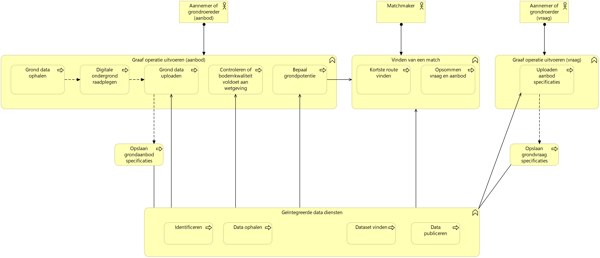
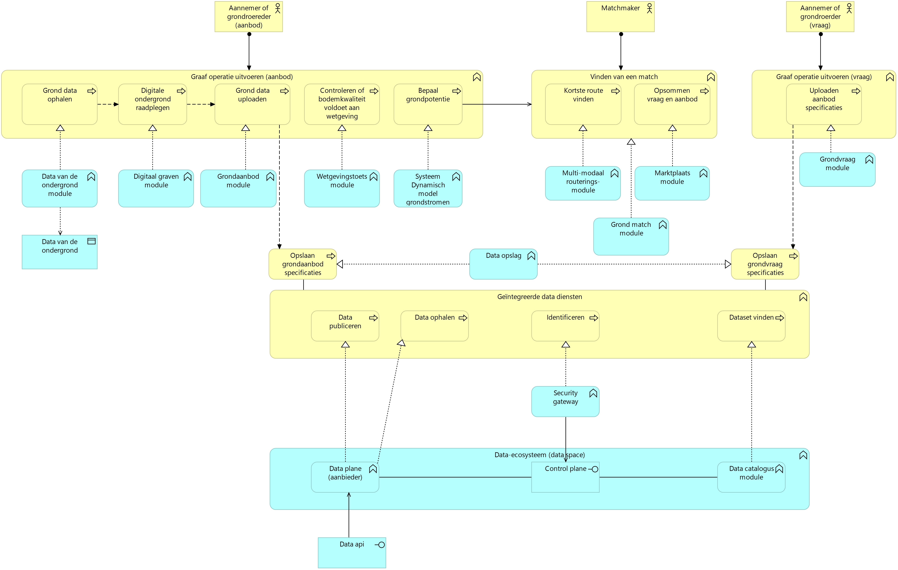
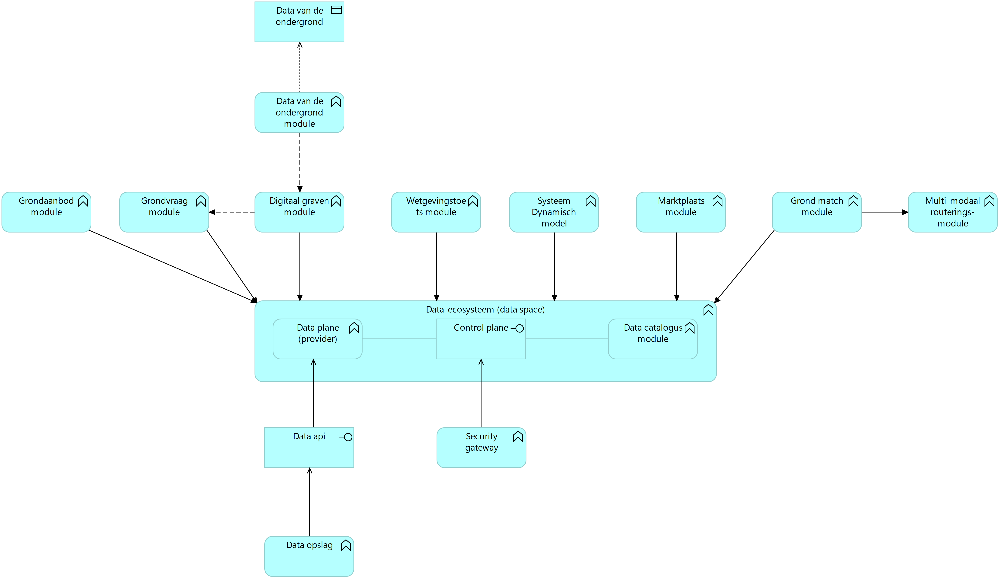

# Uitvoering experiment en use cases Circulaire grondstromen {#181E2B20}
## Use cases Digital Twin Circulaire grondstromen {#2152E6F8}
De Circulaire Grondstromen Use Case onderzoekt of een dataspace kan worden 
ingezet om een marktplaats voor grond te faciliteren. Door de groeiende vraag 
naar kwalitatief goede grond voor bouwprojecten wordt het steeds moeilijker 
om aan deze vraag te voldoen. Tegelijkertijd nemen de beschikbare hoeveelheden 
grond af, vooral bij hoogwaardige zandsoorten. Dit creëert een dringende behoefte 
aan een duurzame manier van grondgebruik en grondverplaatsing. 

Graafwerkzaamheden waarbij grond wordt gewonnen, bieden kansen om de opkomende 
knelpunten aan te pakken. In de toekomst is het onvermijdelijk dat grondketens 
veel circulairder worden. Om tekorten te voorkomen, is het cruciaal om gewonnen 
grond efficiënt te koppelen aan de bestaande vraag. Dit matchen van secundaire 
grond aan de vraag is echter complex en afhankelijk van de eigenschappen van 
grondpartijen (soort, kwaliteit, volume), tijdsbeperkingen en transportlogistiek. 
Omdat deze gegevens en informatie versnipperd zijn, ontbreekt vaak het overzicht. 

Een geïntegreerde, datagedreven aanpak kan helpen om vraag en aanbod slimmer op 
elkaar af te stemmen. Een dataspace kan hierin een belangrijke rol spelen. Door 
aanbieders en afnemers van grond via een dataspace te laten samenwerken, kan slimme 
software de vraag en het aanbod matchen en zo efficiëntere grondverplaatsing mogelijk maken.

Onderstaande afbeelding geeft functioneel weer hoe grondafnemers en grondaanbieders aan elkaar gekoppeld kunnen worden.
</img>
De linkerkant van de het schema toont de grondafnemer en de rechterkant de aanbieder.
De belangrijkste elementen worden hieronder beschreven:

### Hoofdprocessen
1. **Gronddata ophalen**  
   - Door middel van open overheidsdata wordt informatie over de grond verzameld.

2. **Digitale ondergrond raadplegen**  
   - Op basis van verzamelde gegevens wordt de digitale ondergrond geraadpleegd 
     om een overzicht te krijgen van de hoeveelheden en kenmerken van beschikbare grond.

3. **Gronddata uploaden**  
   - Informatie over beschikbare grond wordt geüpload zodat het beschikbaar wordt voor verdere analyse.

4. **Controleren of bodemkwaliteit voldoet aan wetgeving**  
   - De kwaliteit van de grond wordt gecontroleerd om te voldoen aan relevante wet- 
     en regelgeving.

5. **Bepaal grondpotentie**  
   - De potentie van de grond wordt bepaald door middel van een rekenmodel, bijvoorbeeld voor hergebruik of andere 
     toepassingen.

6. **Vinden van een match**  
   - Het proces richt zich op het vinden van een optimale match tussen vraag en aanbod 
     door:
     - **Kortste route vinden**: De optimale route vinden via water en/of weg.
     - **Opsommen vraag en aanbod**: Het overzichtelijk maken van beschikbare grond 
       en benodigde grond.

7. **Opslaan specificaties**  
   - Zowel de specificaties van grondaanbod als -vraag worden opgeslagen om later te 
     gebruiken bij het matchen.

### Betrokken actoren
- **Aannemer of grondroerder (aanbod)**  
  - Aannemer of grondroerder met een overschot aan grond.
  
- **Aannemer of grondroerder (vraag)**  
  - Aannemer of grondroerder met een tekort aan grond.

- **Matchmaker**  
  - De matchmaker (overheid) faciliteert het vinden van een match.

### Geïntegreerde datadiensten
- Deze diensten ondersteunen het proces door het identificeren, ophalen, vinden en 
  publiceren van relevante datasets:
  - **Identificeren**: Het faciliteren van het toegang verlenen op basis identificatie.
  - **Data ophalen**: Gebruikers of applicaties hebben de mogelijkheid om data uit verschillende bronnen op te halen.
  - **Dataset vinden**: Gebruikers of applicaties kunnen zoeken naar specifieke datasets.
  - **Data publiceren**: Het beschikbaar maken van data voor alle betrokkenen.

Onderstaande afbeelding geeft de architectuur van de Circulaire grondstromen Use Case weer volgens de Archimate standaard.
</img>

Onderstaande afbeelding geeft de applicatie- en databouwblokken van de Circulaire grondstromen Use Case weer volgens de Archimate standaard.
</img>

## Use case 1:  {#1200E5F8}
User story
 
 
Setup experiment
 
 
Resultaten uitvoering
## Use case 2: {#597A7427}
User story
 
 
Setup experiment
 
 
Resultaten uitvoering
## Use case 3:    {#7B2C0F26}
User story
 
 
Setup experiment
 
 
Resultaten uitvoering
## Bevindingen    {#4041334C}
pm
## Open data en de Dataspace Protocol connector {#7EC41110}
pm 
