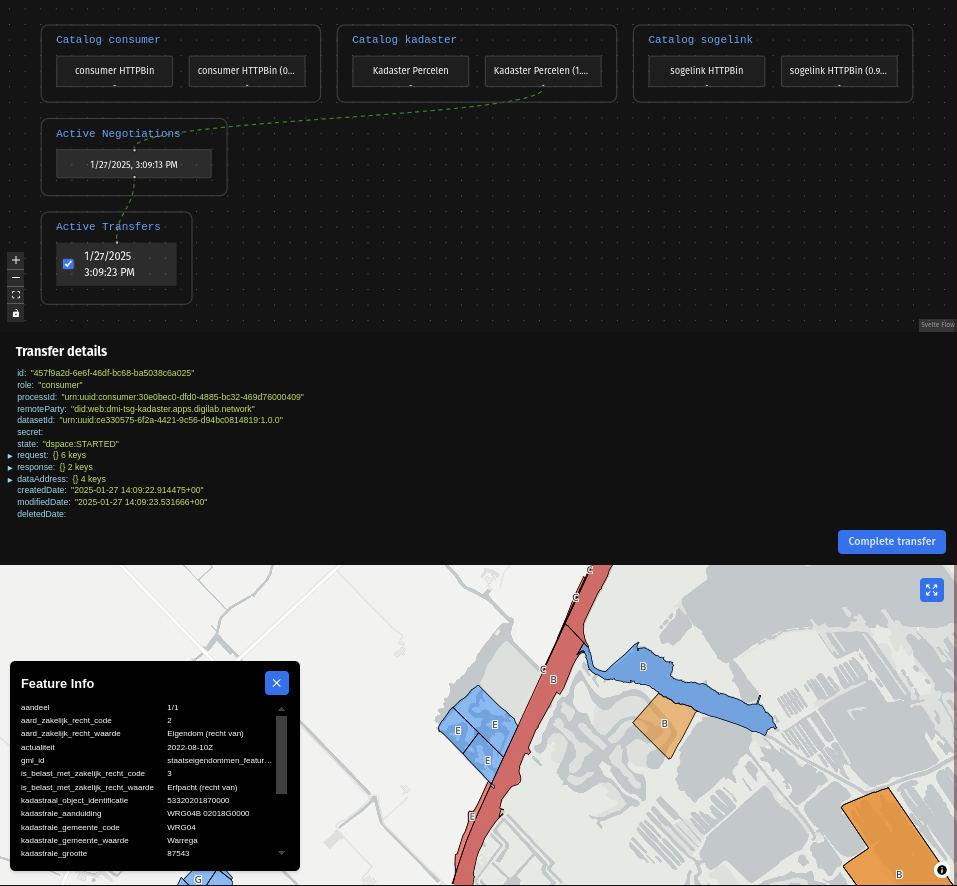

# Experiment 1 - Minimum viable data space

## Systeemopzet - TNO Security Gateway (TSG)
Ons experiment is bedoeld om te verifiëren of we een gegevensoverdracht kunnen realiseren tussen twee connectors binnen een dataspace-ecosysteem. Binnen dit ecosysteem kan elke dataspace-connector fungeren als gegevensaanbieder, consument of beiden. Bovendien zijn connectors gekoppeld aan dataspace-deelnemers (participants), die mensen, instellingen, bedrijven of mogelijk overheden kunnen zijn. In onze specifieke opzet implementeren we één gegevensaanbieder, genaamd `Alfa`, en één consument, genaamd `Bravo`, onder dezelfde deelnemer voor simulatie-doeleinden. 
<br/>
De TNO Security Gateway is een kant-en-klare implementatie van dataspace componenten, die door TNO worden aangeboden. De documentatie die bij het project wordt geleverd, legt uit hoe een volledig werkende dataspace connector op een eigen cloudomgeving kan worden geïmplementeerd. Hieronder richten we ons op de modulaire indeling van de dataspace-connector zoals beschreven door TNO: controle plane, data plane en wallet. 
<br/>

**Control Plane**
De control plane fungeert als het "brein" van een dataspace-connector en stelt ons in staat het grootste deel van de functionaliteiten van het dataspace-protocol uit te voeren. Het biedt onder andere authenticatie door een token te genereren dat een vastgestelde tijd geldig is en dat kan worden gebruikt voor verdere acties. Na authenticatie kunnen we catalogi bekijken, een onderhandeling starten met een andere connector (bijvoorbeeld als gegevensaanbieder) en eventueel overgaan tot een gegevensoverdracht.
<br/>

**HTTP Data Plane**
De data plane fungeert als tegenhanger van de control plane voor een specifieke connector. Simpel gezegd volgt het de instructies van de control plane met betrekking tot gegevensoverdracht. Als het wordt gebruikt als consument, stelt het ons in staat directe gegevensdownloads uit te voeren of gegevens op te halen via API-requests van de data plane van een aanbieder.
<br/>

**Wallet**
De wallet bevat de verifieerbare referenties voor elke deelnemer binnen de dataspace. Een deelnemer kan aan meerdere connectors worden gekoppeld, maar andersom is dit niet het geval. Een centrale wallet (of meerdere wallets) geeft referenties uit aan deelnemers binnen het dataspace-ecosysteem.
<br/>

Dit experiment toont de mogelijkheden van de TNO Security Gateway (TSG) als data space connector voor het opzetten van een minimale functionele data space in een gecontaineriseerde omgeving. Het laat zien hoe data space partijen data kunnen delen binnen een gecontroleerde en veilige omgeving. Dit is een essentiële stap in het realiseren van interoperabele en veilige data space toepassingen. We hebben hier gewerkt met de volgende componenten: 
<br/>

<ol>
  <li>Infratructuur.Het dataspace-ecosysteem is opgezet binnen een Kubernetes-cluster op de omgeving van Sogelink. Dit cluster host zowel de autoriteit als de twee deelnemers.</li>
  <li>TNO Security Gateway (TSG). Alle dataspace deelnemers maken gebruik van de TSG componenten om data-uitwisseling te faciliteren en beveiligingsmechanismen te handhaven: 
- Autoriteit: Beheert de registratie van deelnemers, policies en data catalogus.
- Deelnemer 1 (Alfa) fungeert als data aanbieder;
- Deelnemer 2 (Bravo) fungeert als data consument.
  </li>
    <li>Technologieën. Het dataspace-ecosysteem is opgezet binnen een Kubernetes-cluster op de omgeving van Sogelink. Dit cluster host zowel de autoriteit als de twee deelnemers. 
    - Kubernetes voor het beheer van containers en schaalbaarheid;
    - TSG voor dataspace-beveiliging en gegevensbeheer;
    - TSG CLI voor het creëren van een configuratie en de uitrol van de data space connector.
    De uitrol van het TSG data connector op de kubernetes-cluster heeft geresulteerd in een werkend minimal viable dataspace met 3 deelnemers: de autoriteit, alfa en bravo. In het experiment is het gelukt om een contract op te zetten tussen alfa en bravo, waarbij bravo toegang krijgt tot een dataset van alfa. De data-uitwisseling is vervolgens ook succesvol verlopen. Daarnaast zijn er enkele uitdagingen en problemen geïdentificeerd tijdens het proces, zoals beschreven in de noot "Tegengekomen problemen en oplossingen". Uiteindelijk functioneerde de minimal viable dataspace zoals verwacht, en zijn de services toegankelijk en operationeel.</li>
</ol>
<br/>
<br/>

De doorlopen stappen en opgedane ervaringen met de uitrol van de TSG binnen een Kubernetes-cluster op de omgeving van Sogelink zijn hieronder uiteengezet. Achtereenvolgens gaat het om:
</ol>
  <li>het installeren van vereiste ondersteunende software (NodeJS & NPM, TSG CLI en Kubectl);</li>
  <li>het bootstrappen (configuratiebestanden maken) van de TSG software;</li>
  <li>het uitrollen van de TSG softwareKubernetes-cluster op de omgeving van Sogelink Research.</li>
</ol>
<br/>

**NodeJS & NPM**

Voor het installeren van de TSG CLI is NodeJS en NPM vereist. Wanneer deze nog niet geïnstalleerd zijn zoek dan de juiste installatie-instructies voor jouw besturingssysteem.
<br/>

**TSG CLI**

TNO heeft een CLI-tool ontwikkeld die het uitrollen van een TSG-ecosysteem vergemakkelijkt. Deze tool kan geïnstalleerd worden met het volgende commando:

```bash
npm install -g @tsg-dsp/cli@latest
```

Meer informatie over de TSG CLI is te vinden in de [documentatie](https://tsg.dataspac.es/docs/tools/cli/)
<br/>

**Kubectl**

Om verbinding te maken met het Kubernetes-cluster is kubectl vereist. Zorg ervoor dat kubectl correct is geconfigureerd en toegang heeft tot het cluster waar het eco-systeem wordt uitgerold.
<br/>

**TSG Bootstrapping**

Met de TSG CLI kunnen de configuratiebestanden voor het dataspace-ecosysteem worden gegenereerd. Een voorbeeldconfiguratie is te vinden in de [TSG-repository](https://gitlab.com/tno-tsg/dataspace-protocol/tno-security-gateway/-/blob/main/website/docs/deployment/ecosystem.yaml) Deze ziet er ongeveer als volgt uit:

```yaml
general:
  namespace: tsg-ecosystem
  username: tsg
  password: changeme
  authorityDomain: authority.example.com
  credentialType: ExampleCredential
participants:
  - host: authority.example.com
    id: authority
    name: Dataspace Authority
    routing: subdomain
    issuer: true
    hasControlPlane: false
    document:
      "@context":
        "@protected": true
        "@version": 1.1
        ExampleCredential:
          "@context":
            - https://www.w3.org/2018/credentials/v1
          "@id": example:ExampleCredential
        id: "@id"
        example: https://authority.example.com/context/ExampleCredential
        type: "@type"
    schema:
      type: object
      title: ExampleCredential
      additionalProperties: true
      properties:
        id:
          type: string
          pattern: "^did:web:.*"
      required:
        - id
  - host: alfa.example.com
    id: alfa
    name: Alfa
    hasTestService: true
    hasControlPlane: true
    issuer: false
    preAuthorizationCode: 386527fd21960fd8bd3aa0208c9275a4437fde1bdae9469daaf91fb7cace67d827ff152e5f89c02ccdbde1766387feb2
...
```
Hier kunnen we het een en ander aanpassen, zoals de namespace, gebruikersnaam, wachtwoord, domeinnaam, enzovoort. Dit is een voorbeeldconfiguratie, het is belangrijk om de waarden aan te passen aan de specifieke omgeving en vereisten.

Gebruik vervolgens de CLI-tool om de initiële configuratie van het ecosysteem om te zetten in specifieke configuraties per service:

```bash
tsg bootstrap -f ./ecosystem.yaml -o ./output ecosystem
```
Na het bootstrappen van de configuratiebestanden eindigen we met een mapstructuur die er ongeveer als volgt uitziet:

```bash
output/
├── authority
│   ├── values.casdoor.yaml
│   ├── values.postgres.yaml
│   ├── values.wallet.yaml
|-- alfa
│   ├── values.casdoor.yaml
│   ├── values.control-plane.yaml
│   ├── values.http-data-plane.yaml
│   ├── values.postgres.yaml
│   ├── values.wallet.yaml
|-- bravo
│   ├── ...
...
```

Iedere deelnemer heeft zijn eigen map met specifieke configuratiebestanden voor de verschillende services die nodig zijn voor de uitrol van een deelnemer.
<br/>
<br/>

**Uitrol van de TSG**

Nadat de configuratiebestanden zijn aangemaakt, kan de data space uitgerold worden met de `TSG CLI TOOL` doormiddel van het volgende commando:

```bash
tsg deploy -f ./ecosystem.yaml --config ./output ecosystem
```

Dit commando zal alle benodigde HELM-charts installeren in het Kubernetes-cluster en alle componenten voor de deelnemers opzetten. Wanneer alles goed is gegaan zouden de deelnemers nu operationeel moeten zijn en klaar voor gebruik.

<aside class='note' title="Tegengekomen problemen en oplossingen">
<br/>
<br/>

**TSG Versie 0.4.1**

Een probleem in versie 0.4.1 is dat /api onterecht wordt toegevoegd aan de publicAddress in de configuratiebestanden, wat leidt tot foutmeldingen (Bad Request). Oplossing: Verwijder handmatig /api uit alle values.wallet.yaml-bestanden in de outputmap.
Dit probleem is inmiddels opgelost in nieuwere versies van TSG.
<br/>
<br/>

**Gebruikersnaam admin**

In onze uitrol wilde we een user `admin` gebruiken, dit bleek niet mogelijk omdat dit conflicteerde met `casdoor-init` job.

```bash
Error: Job failed to run due to conflicting username.
```

Oplossing: Gebruik een andere gebruikersnaam dan `admin`.
<br/>
<br/>

**Ingress**

In de TSG documentatie is de volgende requirement te vinden:

```bash
Ingress Controller with publicly available routes, e.g. Ingress NGINX Controller. Combined with TLS encryption on the ingress controller, e.g. via CertManager. Required for hosting/resolvement of DID documents, even when all participants are on the same cluster.
```

Door een beperking in onze clusteromgeving worden de door TSG aangemaakte ingress-regels niet automatisch opgepikt door onze gateway-operator (Traefik). Oplossing: Handmatig gateway-regels toevoegen aan de gateway operator om alles bereikbaar te maken.
</aside>

## Opstelling

De digilab-omgeving is opgezet dmv de TNO Security Gateway (TSG) met een authority en een Kadaster-deelnemer. Op het Sogelink platform is enkel een deelnemer uitgerold welke onderdeel is van de dataspace door zich te registreren met de dataspace authority op Digilab. De Kadaster-deelnemer stelt een dataset beschikbaar met perceel gegevens welke bevraagd kan worden via de dataspace.

In figuur 16 is te zien hoe de verschillende componenten met elkaar communiceren. De deelnemer op het Sogelink platform maakt deel uit van de dataspace via de authority op Digilab. De deelnemer kan een contract afsluiten met de Kadaster deelnemer op Digilab om vervolgens via de http-data-plane de data van de Kadaster deelnemer te bevragen welke intern doorgezet (proxy) wordt naar de Kadaster API Service.

<figure id="Figuur_x">
<a href="media/Opzet experiment MVDS Eigendommenkaart.jpg" target="_blank"></a>
<figcaption>Opzet experiment MVDS Eigendommenkaart<figcaption>
</figure>
<br/>

**Dataset: Eigendommenkaart**

pm
<br/>

**Digilab**

Het Digilab team heeft een basis setup van een dataspace ecosyteem opgezet zoals beschreven in paragraaf 4.2. Om de setup bruikbaar te maken voor onze use-case hebben we de setup aangepast zodat de deata aanbieder Alpha de dataset (eigendommenkaart van het Kadaster)  met echte data beschikbaar stelt via een interne API (OGC API Features).
<br/>

**Authority**

De authority is de centrale autoriteit van de dataspace en beheert de registratie van deelnemers en policies. De authority is verantwoordelijk voor het toezicht houden op de dataspace en het beheren van de toegangscontrole. Deelnemers buiten het Digilab platform kunnen zich registreren bij de authority en toegang krijgen tot de dataspace. 
<br/>

**Kadaster API**

Voor dit experiment hebben we een kleine subset van de eigendommenkaart van het Kadaster beschikbaar gesteld via een OGC API Features service. De OGC API Features service is met behulp van [gokoala](https://github.com/PDOK/gokoala) opgezet. De service is uitgerold op de digilab omgeving en is niet publiekelijk toegankelijk en kan dus enkel intern op het Digilab platform benaderd worden.
<br/>

**Deelnemer Kadaster**

De Kadaster deelnemer is een deelnemer in de dataspace, de deelnemer registreert zich bij de authority en stelt een `kadaster percelen` dataset beschikbaar via de dataspace. De data-plane van de deelnemer is de standaard TSG [http-data-plane](https://tsg.dataspac.es/docs/apps/http-data-plane/) zie ook section 3.3.2. Deze data-plane is geconfigureerd om inkomende vragen te proxien naar de interne Kadaster API Service. Doordat de kadaster deelnemer intern de API service kan benaderen kan de data via de dataspace gedeeld worden met andere deelnemers binnen de dataspace wanneer er een contract is afgesloten.
<br/>

**Deelnemer Sogelink**

Op het Sogelink platform is enkel één deelnemer uitgerold die onderdeel is van de dataspace. De deelnemer registreert zich bij de authority op Digilab en krijgt toegang tot de dataspace. De deelnemer kan vervolgens een contract afsluiten met de Kadaster deelnemer om toegang te krijgen tot de `kadaster percelen` dataset.
<br/>

**Data viewer**

Als test hebben we een eenvoudige data viewer uitgerold op het Sogelink platform welke data van de Kadaster deelnemer kan bevragen via de Sogelink deelnemer.

## Uitvoering

Na de uitrol van de TSG data connector en een werkende minimale functionerende data space zijn is een experiment uitgevoerd met het delen van een geografische dataset via minimum viable dataspace principe waarvan de geodataset beschikbaar is gemaakt via een OGC API Features.
In dit experiment hebben we een minimal viable data space opgezet waarin systemen van verschillende organisaties samenwerken om een geodataset, de egendommenkaart van het Kadaster -  veilig en gecontroleerd uit te wisselen. De authority van de dataspace is uitgerold op het [Digilab-platform](https://digilab.overheid.nl/), samen met een `Kadaster` deelnemer. Vervolgens hebben we op het Sogelink Research platform een deelnemer uitgerold die onderdeel is van de dataspace op digilab. Het doel was om Kadaster-data, beschikbaar gesteld via een interne API service op Digilab, te delen met een deelnemer op het Sogelink platform.
<br/>

Het doel van dit experiment is tweeledig:
<ol>
  <li>Het valideren van de interoperabiliteit tussen dataspace-deelnemers op verschillende platforms;</li>
  <li>Het uitwisselen van data tussen dataspace-deelnemers waarbij de data afkomstig is van een afgeschermde API.</li>
</ol>
<br/>
Dit experiment simuleert een meer realistischere situatie waarin twee organisaties samenwerken in een minimum viable dataspace setting, en waarbij een centrale authority toezicht houdt op toegangsbeheer en beveiliging. Het experiment richtte zich op de interoperabiliteit tussen twee verschillende systemen en heeft data gedeeld afkomstig van een afgeschermde API zoals vaak het geval zal zijn in de praktijk.

## Resultaat

Het experiment is succesvol verlopen en de data van de Kadaster deelnemer is succesvol gedeeld met de deelnemer op het Sogelink platform. De deelnemer op het Sogelink platform heeft een contract afgesloten met de Kadaster deelnemer en kan de data van de Kadaster deelnemer bevragen via de dataspace. De viewer op het Sogelink platform kan de data van de Kadaster deelnemer inzien en weergeven. Kadaster data is in deze opstellingen alleen binnen de dataspace beschikbaar en vereist een contract tussen de deelnemers.

In onderstaande Figuur 17 is de viewer te zien welke de data van de Kadaster deelnemer weergeeft op een kaart, daarnaast wordt er extra informatie getoond over beschikbare datasets binnen de dataspace, actieve contracten en transfers.

<figure id="Figuur_x">
<a href="media/experiment2_viewer.jpg" target="_blank"></a>
<figcaption>data transfer van de eigendommenkaart zichtbaar gemaakt in data viewer<figcaption>
</figure>


