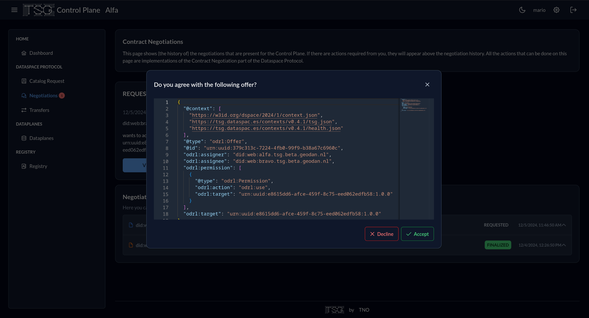

# Minimum viable data space

## Inleiding
Voor de uitvoering van het experiment is de volgende aanpak gehanteerd. Volgens het concept van een ‘minimum viable data space’ zijn enkele experimenten uitgevoerd met vertrouwd en souvereign data delen. Daarbij is het open en gestandaardiseerd ‘Dataspace Protocol’ toegepast, dat is geïmplementeerd in diverse data connector software producten. Er is gebruik gemaakt van de TNO Security Gateway (TSG), die als open source software beschikbaar is. Deze <a href='https://internationaldataspaces.org/data-connector-report/' target='_blank'>implementatie van het Dataspace Protocol is gecertificeerd</a> door het IDSA. 
<br/>
<br/>
Een Minimum Viable Data Space (MVDS) is een combinatie van componenten die het mogelijk maken om een data space te creëren met net genoeg functies om bruikbaar te zijn voor veilige en soevereine data-uitwisseling tussen twee partijen, zoals gespecificeerd door de International Data Spaces Association (IDSA). Het doel van een MVDS is om het implementatieproces te stroomlijnen, waardoor het gemakkelijker en sneller wordt om een werkende data space te creëren met veilige en soevereine data-uitwisseling. Door te beginnen met een MVDS kan het ontwikkelteam snel itereren en reageren op de vereisten van de data space, door indien nodig aanpassingen te maken om aan de behoeften van gebruikers te voldoen.
<br/>
<br/>
Het MVDS concept willen we toepassen om het werk van het experiment te vergemakkelijken door de implementatietijd te verkorten (door lange details te vermijden die de eerste release zouden vertragen). Dit stelt ons in staat om te beginnen met een eerste werkende versie (waar veilige en soevereine data-uitwisseling tussen twee partijen wordt toegestaan), waar het ontwikkelteam de aannames over de vereisten van de data space kan herhalen, identificeren en erop kan reageren. 
<br/>
<br/>
</b>Componenten van een MVDS</b>

Een MVDS bestaat uit:
1. Twee connectoren (één als dataprovider en één als dataconsument); 
2. Een identiteitsprovider (Dynamic Attribute Provisioning Service, Certificate Authority);
3. Optionele en aanvullende componenten, zoals een metadata makelaar, een app store, een clearinghouse of een vocabulaireprovider, kunnen aan de MVDS worden toegevoegd om de functionaliteit uit te breiden en meer geavanceerde functies mogelijk te maken, zoals het zoeken naar datasets.
<br/>
<br/>
De MVDS biedt een startpunt voor het experiment om een functionele data space te creëren, die naar behoefte kan worden aangepast en uitgebreid om aan specifieke vereisten te voldoen.
<br/>
<figure id="Figuur_x">
<a href="media/image4.png" target="_blank"></a>
<figcaption>Minimum Viable Data Space<figcaption>
</figure>
<br/>

## Systeemopzet; TNO Security Gateway (TSG)
Ons experiment is bedoeld om te verifiëren of we een gegevensoverdracht kunnen realiseren tussen twee connectors binnen een dataspace-ecosysteem. Binnen dit ecosysteem kan elke dataspace-connector fungeren als gegevensaanbieder, consument of beiden. Bovendien zijn connectors gekoppeld aan dataspace-deelnemers (participants), die mensen, instellingen, bedrijven of mogelijk overheden kunnen zijn. In onze specifieke opzet implementeren we één gegevensaanbieder, genaamd `Alfa`, en één consument, genaamd `Bravo`, onder dezelfde deelnemer voor simulatie-doeleinden. 

De TNO Security Gateway is een kant-en-klare implementatie van dataspace componenten, die door TNO worden aangeboden. De documentatie die bij het project wordt geleverd, legt uit hoe een volledig werkende dataspace connector op een eigen cloudomgeving kan worden geïmplementeerd. Hieronder richten we ons op de modulaire indeling van de dataspace-connector zoals beschreven door TNO: controle plane, data plane en wallet. 
<br/>
<br/>

**Control Plane**
De control plane fungeert als het "brein" van een dataspace-connector en stelt ons in staat het grootste deel van de functionaliteiten van het dataspace-protocol uit te voeren. Het biedt onder andere authenticatie door een token te genereren dat een vastgestelde tijd geldig is en dat kan worden gebruikt voor verdere acties. Na authenticatie kunnen we catalogi bekijken, een onderhandeling starten met een andere connector (bijvoorbeeld als gegevensaanbieder) en eventueel overgaan tot een gegevensoverdracht.
<br/>
<br/>

**HTTP Data Plane**
De data plane fungeert als tegenhanger van de control plane voor een specifieke connector. Simpel gezegd volgt het de instructies van de control plane met betrekking tot gegevensoverdracht. Als het wordt gebruikt als consument, stelt het ons in staat directe gegevensdownloads uit te voeren of gegevens op te halen via API-requests van de data plane van een aanbieder.
<br/>
<br/>

**Wallet**
De wallet bevat de verifieerbare referenties voor elke deelnemer binnen de dataspace. Een deelnemer kan aan meerdere connectors worden gekoppeld, maar andersom is dit niet het geval. Een centrale wallet (of meerdere wallets) geeft referenties uit aan deelnemers binnen het dataspace-ecosysteem.

## Functies en processen van de minimum viable dataspace {#01C8311E}
Elke module heeft fundamentele functies en kan niet worden weggelaten in de context van een minimale functionele dataspace. Bovendien heeft elke module na de basisimplementatie van TSG zijn eigen dashboard service. We zullen deze dashboards gebruiken om de basisworkflow en het experiment binnen een dataspace te demonstreren. In deze sectie beschrijven we de kernstappen die nodig zijn voor een gegevensoverdracht tussen twee connectors die afzonderlijk optreden als consument en aanbieder.

### Onboarding door aanbieder en consument {#4D30B938}
pm
### Dataproducten aanbieden {#32BDC7C7}
pm
### Bekijken en wijzigen van condities (‘policies’) {#143AA289}
We laten zien hoe regels kunnen worden gewijzigd voor de dataset `BravoHTTPBin` van `Bravo`. Je kunt vrijelijk toestemmingen en verboden toevoegen.

</img>

### Zoeken van catalogi van andere aanbieders ('participants') {#59F4CA7D}
pm

### Zoek dataproducten in de catalogus {#79E15E32}
In de `Registry` binnen de control plane van een connector kunnen we de lijst vinden van gegevensbronnen die worden aangeboden door de huidige connector en de externe connectors waarvan onze connector op de hoogte is.

</img>

In het voorbeeld zien we de dataset `Bravo HTTPBin` dat toebehoort aan de consument `Bravo` evenals `Kadaster Percelen` en `Alfa HTTPBin` die toebehoren aan `Alfa`.

### Contractonderhandeling aanbieder en consument {#288808F5}
De onderhandeling over een contract met betrekking tot een specifiek dataproduct omvat meerdere stappen tussen de consument en aanbieder. Eerst stuurt de consument `Bravo` een onderhandelingsverzoek naar de aanbieder `Alfa` zoals hieronder weergegeven.

</img>

Nu beslist de aanbieder `Alfa` of hij de ontvangen onderhandeling van `Bravo` wil accepteren.

</img>

Bij acceptatie, en na ondertekening en tegenondertekening op beide control planes, mag `Bravo` uiteindelijk de gegevensoverdracht aanvragen zoals in de volgende afbeelding wordt getoond.

</img>

### Gegevensoverdracht tussen aanbieder en consument {#7BC4931F}
Zodra de consument de overdracht aanvraagt bij de aanbieder, wordt de overdracht als gestart beschouwd en blijft "open" totdat deze door een van de betrokken partijen als `Beëindigd` of `Voltooid` wordt gemarkeerd.

</img>

Wat betekent "open"? Het betekent dat daadwerkelijke gegevensoverdrachten kunnen worden uitgevoerd tussen de data planes van de consument en aanbieder. Om echt gegevens van aanbieder `Alfa` naar consument `Bravo` te verplaatsen, moeten we authenticeren op de interface van de data plane van de consument en een specifiek HTTP-verzoek doorsturen naar de API van de aanbieder. In dit geval gebruiken we de OGC API-endpoint die beschikbaar is via de Kadaster data plane van `Alfa` om een verzameling Nederlandse gebouwen op te vragen.

</img>

De response van het verzoek ziet er dan als volgt uit:

</img>

## Opstelling TNO Security Gateway (TSG) 
Dit experiment toont de mogelijkheden van de TNO Security Gateway (TSG) als IDS data connector voor het opzetten van een minimale functionele dataspace in een gecontaineriseerde omgeving. Het laat zien hoe dataspace partijen data kunnen delen binnen een gecontroleerde en veilige omgeving. Dit is een essentiële stap in het realiseren van interoperabele en veilige dataspaces voor toekomstige dataspace toepassingen. We hebben hier gewerkt met de volgende componenten: 
<br/>
<br/>

**Infrastructuur** 
Het dataspace-ecosysteem is opgezet binnen een Kubernetes-cluster op de omgeving van Sogelink. Dit cluster host zowel de autoriteit als de twee deelnemers.
<br/>
<br/>

**TNO Security Gateway (TSG)** 
Alle dataspace deelnemers maken gebruik van de TSG componenten om data-uitwisseling te faciliteren en beveiligingsmechanismen te handhaven: 
- Autoriteit: Beheert de registratie van deelnemers, policies en data catalogus.
- Deelnemer 1 (Alfa) fungeert als data aanbieder;
- Deelnemer 2 (Bravo) fungeert als data consument.
<br/>
<br/>

**Technologieën**
- Kubernetes voor het beheer van containers en schaalbaarheid.
- TSG voor dataspace-beveiliging en gegevensbeheer.
- TSG CLI voor het creëren van een configuratie en de uitrol van de data space connector.

De uitrol van het TSG data connector op de kubernetes-cluster heeft geresulteerd in een werkend minimal viable dataspace met 3 deelnemers: de autoriteit, alfa en bravo. In het experiment is het gelukt om een contract op te zetten tussen alfa en bravo, waarbij bravo toegang krijgt tot een dataset van alfa. De data-uitwisseling is vervolgens ook succesvol verlopen. Daarnaast zijn er enkele uitdagingen en problemen geïdentificeerd tijdens het proces, zoals beschreven in de noot "Tegengekomen problemen en oplossingen". Uiteindelijk functioneerde de minimal viable dataspace zoals verwacht, en zijn de services toegankelijk en operationeel.

De doorlopen stappen en opgedane ervaringen met de uitrol van de TSG binnen een Kubernetes-cluster op de omgeving van Sogelink zijn hieronder uiteengezet. Achtereenvolgens gaat het om:
1. het installeren van vereiste ondersteunende software (NodeJS & NPM, TSG CLI en Kubectl);
2. het bootstrappen (configuratiebestanden maken) van de TSG software; 
3. het uitrollen van de TSG softwareKubernetes-cluster op de omgeving van Sogelink. 
<br/>
<br/>

**NodeJS & NPM**
Voor het installeren van de TSG CLI is NodeJS en NPM vereist. Wanneer deze nog niet geïnstalleerd zijn zoek dan de juiste installatie-instructies voor jouw besturingssysteem.
<br/>
<br/>

**TSG CLI**

TNO heeft een CLI-tool ontwikkeld die het uitrollen van een TSG-ecosysteem vergemakkelijkt. Deze tool kan geïnstalleerd worden met het volgende commando:

```bash
npm install -g @tsg-dsp/cli@latest
```

Meer informatie over de TSG CLI is te vinden in de [documentatie](https://tsg.dataspac.es/docs/tools/cli/)
<br/>
<br/>

**Kubectl**

Om verbinding te maken met het Kubernetes-cluster is kubectl vereist. Zorg ervoor dat kubectl correct is geconfigureerd en toegang heeft tot het cluster waar het eco-systeem wordt uitgerold.
<br/>
<br/>

**TSG Bootstrapping**

Met de TSG CLI kunnen de configuratiebestanden voor het dataspace-ecosysteem worden gegenereerd. Een voorbeeldconfiguratie is te vinden in de [TSG-repository](https://gitlab.com/tno-tsg/dataspace-protocol/tno-security-gateway/-/blob/main/website/docs/deployment/ecosystem.yaml) Deze ziet er ongeveer als volgt uit:

```yaml
general:
  namespace: tsg-ecosystem
  username: tsg
  password: changeme
  authorityDomain: authority.example.com
  credentialType: ExampleCredential
participants:
  - host: authority.example.com
    id: authority
    name: Dataspace Authority
    routing: subdomain
    issuer: true
    hasControlPlane: false
    document:
      "@context":
        "@protected": true
        "@version": 1.1
        ExampleCredential:
          "@context":
            - https://www.w3.org/2018/credentials/v1
          "@id": example:ExampleCredential
        id: "@id"
        example: https://authority.example.com/context/ExampleCredential
        type: "@type"
    schema:
      type: object
      title: ExampleCredential
      additionalProperties: true
      properties:
        id:
          type: string
          pattern: "^did:web:.*"
      required:
        - id
  - host: alfa.example.com
    id: alfa
    name: Alfa
    hasTestService: true
    hasControlPlane: true
    issuer: false
    preAuthorizationCode: 386527fd21960fd8bd3aa0208c9275a4437fde1bdae9469daaf91fb7cace67d827ff152e5f89c02ccdbde1766387feb2
...
```
Hier kunnen we het een en ander aanpassen, zoals de namespace, gebruikersnaam, wachtwoord, domeinnaam, enzovoort. Dit is een voorbeeldconfiguratie, het is belangrijk om de waarden aan te passen aan de specifieke omgeving en vereisten.

Gebruik vervolgens de CLI-tool om de initiële configuratie van het ecosysteem om te zetten in specifieke configuraties per service:

```bash
tsg bootstrap -f ./ecosystem.yaml -o ./output ecosystem
```
Na het bootstrappen van de configuratiebestanden eindigen we met een mapstructuur die er ongeveer als volgt uitziet:

```bash
output/
├── authority
│   ├── values.casdoor.yaml
│   ├── values.postgres.yaml
│   ├── values.wallet.yaml
|-- alfa
│   ├── values.casdoor.yaml
│   ├── values.control-plane.yaml
│   ├── values.http-data-plane.yaml
│   ├── values.postgres.yaml
│   ├── values.wallet.yaml
|-- bravo
│   ├── ...
...
```

Iedere deelnemer heeft zijn eigen map met specifieke configuratiebestanden voor de verschillende services die nodig zijn voor de uitrol van een deelnemer.
<br/>
<br/>

**Uitrol van de TSG**
Nadat de configuratiebestanden zijn aangemaakt, kan de data space uitgerold worden met de `TSG CLI TOOL` doormiddel van het volgende commando:

```bash
tsg deploy -f ./ecosystem.yaml --config ./output ecosystem
```

Dit commando zal alle benodigde HELM-charts installeren in het Kubernetes-cluster en alle componenten voor de deelnemers opzetten. Wanneer alles goed is gegaan zouden de deelnemers nu operationeel moeten zijn en klaar voor gebruik.

<aside class='note' title="Tegengekomen problemen en oplossingen">
<br/>
<br/>

**TSG Versie 0.4.1**

Een probleem in versie 0.4.1 is dat /api onterecht wordt toegevoegd aan de publicAddress in de configuratiebestanden, wat leidt tot foutmeldingen (Bad Request). Oplossing: Verwijder handmatig /api uit alle values.wallet.yaml-bestanden in de outputmap.
Dit probleem is inmiddels opgelost in nieuwere versies van TSG.
<br/>
<br/>

**Gebruikersnaam admin**

In onze uitrol wilde we een user `admin` gebruiken, dit bleek niet mogelijk omdat dit conflicteerde met `casdoor-init` job.

```bash
Error: Job failed to run due to conflicting username.
```

Oplossing: Gebruik een andere gebruikersnaam dan `admin`.
<br/>
<br/>

**Ingress**

In de TSG documentatie is de volgende requirement te vinden:

```bash
Ingress Controller with publicly available routes, e.g. Ingress NGINX Controller. Combined with TLS encryption on the ingress controller, e.g. via CertManager. Required for hosting/resolvement of DID documents, even when all participants are on the same cluster.
```

Door een beperking in onze clusteromgeving worden de door TSG aangemaakte ingress-regels niet automatisch opgepikt door onze gateway-operator (Traefik). Oplossing: Handmatig gateway-regels toevoegen aan de gateway operator om alles bereikbaar te maken.
</aside>

Na de uitrol van de TSG data connector en een werkende minimale functionerende data space zijn een aantal experimenten met de TSG data connector uitgevoerd. In het volgende hoofdstuk 5 is een experiment uitgevoerd met het delen van een geografische dataset via minimum viable dataspace principe waarvan de dataset beschikbaar is gemaakt via een OGC API Features implementatie op de data plane.

