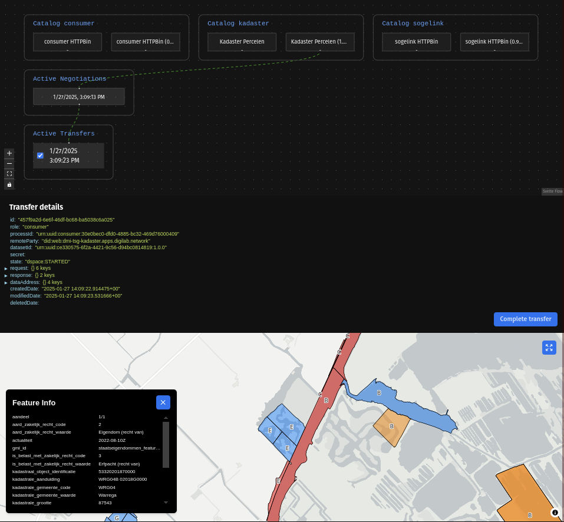

# Experiment 1: Eigendommenkaart delen via minimum viable dataspace  {#1200E5F8}

## Inleiding

In dit experiment hebben we een minimal viable dataspace opgezet waarin systemen van verschillende organisaties samenwerken om gegevens veilig en gecontroleerd uit te wisselen. De authority van de dataspace is uitgerold op het [Digilab-platform](https://digilab.overheid.nl/), samen met een `Kadaster` deelnemer. Vervolgens hebben we op het Sogelink platform een deelnemer uitgerold die onderdeel is van de dataspace op digilab. Het doel was om Kadaster-data, beschikbaar gesteld via een interne API-service op Digilab, te delen met een deelnemer op het Sogelink platform.
 
 

Het doel van dit experiment is tweeledig:
1. Het valideren van de interoperabiliteit tussen dataspace-deelnemers op verschillende platforms;
2. Het uitwisselen van data tussen dataspace-deelnemers waarbij de data afkomstig is van een afgeschermde API.
 
 
Dit experiment simuleert een meer realistischere situatie waarin twee organisaties samenwerken in een minimum viable dataspace setting, en waarbij een centrale authority toezicht houdt op toegangsbeheer en beveiliging. Het experiment richtte zich op de interoperabiliteit tussen twee verschillende systemen en heeft data gedeeld afkomstig van een afgeschermde API zoals vaak het geval zal zijn in de praktijk.

## Opstelling

De digilab-omgeving is opgezet dmv de TNO Security Gateway (TSG) met een authority en een Kadaster-deelnemer. Op het Sogelink platform is enkel een deelnemer uitgerold welke onderdeel is van de dataspace door zich te registreren met de dataspace authority op Digilab. De Kadaster-deelnemer stelt een dataset beschikbaar met perceel gegevens welke bevraagd kan worden via de dataspace.

In figuur ? is te zien hoe de verschillende componenten met elkaar communiceren. De deelnemer op het Sogelink platform maakt deel uit van de dataspace via de authority op Digilab. De deelnemer kan een contract afsluiten met de Kadaster deelnemer op Digilab om vervolgens via de http-data-plane de data van de Kadaster deelnemer te bevragen welke intern doorgezet (proxy) wordt naar de Kadaster API Service.

<figure id="Figuur_x">

<figcaption>Opzet experiment MVDS Eigendommenkaart<figcaption>
</figure>
 
 

**Dataset: Eigendommenkaart**
pm
 
 

**Digilab**

Het Digilab team heeft een basis setup van een dataspace ecosyteem opgezet zoals beschreven in paragraaf 4.2. Om de setup bruikbaar te maken voor onze use-case hebben we de setup aangepast zodat de deata aanbieder Alpha de dataset (eigendommenkaart van het Kadaster)  met echte data beschikbaar stelt via een interne API (OGC API Features).
 
 

**Authority**

De authority is de centrale autoriteit van de dataspace en beheert de registratie van deelnemers en policies. De authority is verantwoordelijk voor het toezicht houden op de dataspace en het beheren van de toegangscontrole. Deelnemers buiten het Digilab platform kunnen zich registreren bij de authority en toegang krijgen tot de dataspace. 
 
 

**Kadaster API**

Voor dit experiment hebben we een kleine subset van de eigendommenkaart van het Kadaster beschikbaar gesteld via een OGC API Features service. De OGC API Features service is met behulp van [gokoala](https://github.com/PDOK/gokoala) opgezet. De service is uitgerold op de digilab omgeving en is niet publiekelijk toegankelijk en kan dus enkel intern op het Digilab platform benaderd worden.
 
 

**Deelnemer Kadaster**

De Kadaster deelnemer is een deelnemer in de dataspace, de deelnemer registreert zich bij de authority en stelt een `kadaster percelen` dataset beschikbaar via de dataspace. De data-plane van de deelnemer is de standaard TSG [http-data-plane](https://tsg.dataspac.es/docs/apps/http-data-plane/) zie ook section 3.3.2. Deze data-plane is geconfigureerd om inkomende vragen te proxien naar de interne Kadaster API Service. Doordat de kadaster deelnemer intern de API service kan benaderen kan de data via de dataspace gedeeld worden met andere deelnemers binnen de dataspace wanneer er een contract is afgesloten.
 
 

**Deelnemer Sogelink**

Op het Sogelink platform is enkel één deelnemer uitgerold die onderdeel is van de dataspace. De deelnemer registreert zich bij de authority op Digilab en krijgt toegang tot de dataspace. De deelnemer kan vervolgens een contract afsluiten met de Kadaster deelnemer om toegang te krijgen tot de `kadaster percelen` dataset.
 
 

**Data viewer**

Als test hebben we een eenvoudige data viewer uitgerold op het Sogelink platform welke data van de Kadaster deelnemer kan bevragen via de Sogelink deelnemer.

## Resultaat

Het experiment is succesvol verlopen en de data van de Kadaster deelnemer is succesvol gedeeld met de deelnemer op het Sogelink platform. De deelnemer op het Sogelink platform heeft een contract afgesloten met de Kadaster deelnemer en kan de data van de Kadaster deelnemer bevragen via de dataspace. De viewer op het Sogelink platform kan de data van de Kadaster deelnemer inzien en weergeven. Kadaster data is in deze opstellingen alleen binnen de dataspace beschikbaar en vereist een contract tussen de deelnemers.

In onderstaande Figuur ? is de viewer te zien welke de data van de Kadaster deelnemer weergeeft op een kaart, daarnaast wordt er extra informatie getoond over beschikbare datasets binnen de dataspace, actieve contracten en transfers.

<figure id="Figuur_x">

<figcaption>Data viewer<figcaption>
</figure>
 

